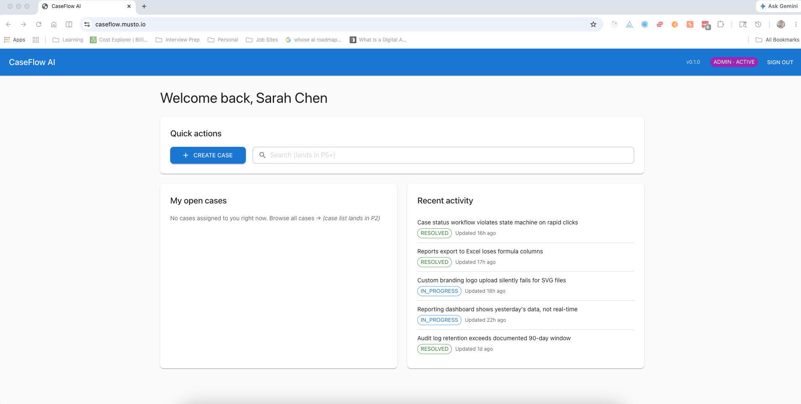
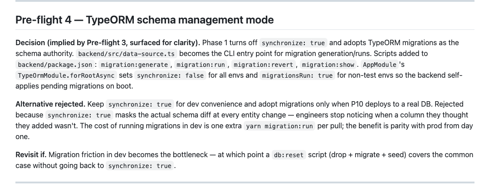
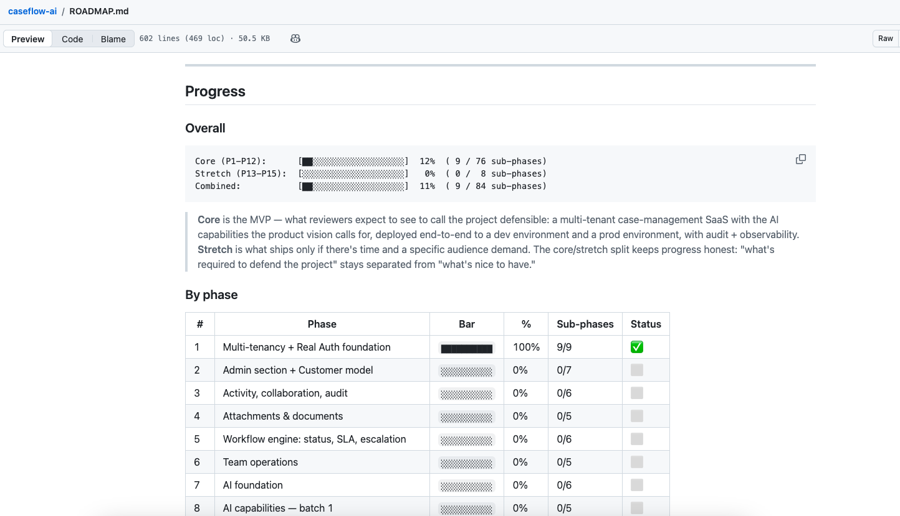

# CaseFlow AI

A multi-tenant case-management SaaS built end-to-end in the open — backend, frontend, infrastructure, deployment — as a working demonstration of an **AI-driven SDLC** at production scale.

**Live demo:** [caseflow.musto.io](https://caseflow.musto.io) (register-and-approve flow — see below)
**Methodology series:** [AI-Ready SDLC — the kickoff](https://www.linkedin.com/in/armandomusto/) (Article 01)
**Current phase:** P1 complete (9/9) · [`ROADMAP.md`](./ROADMAP.md)

---



## What this is

CaseFlow AI is a **portfolio piece designed to be operated, not just read**. The product is a Zendesk-shaped case-management surface: customer organizations log issues, internal engineers work them through a status workflow, and (post-P7) AI capabilities surface case summaries + suggested resolutions gated by human approval.

The **methodology** matters more than the product. Every architectural decision lives in the decision log. Every sub-phase has a 1-page spec written before code is generated. The ROADMAP is the daily working surface, not a quarterly-review slide deck. The repo is the receipt that the work is real.

## Why this repo is separate from the implementation

The implementation code lives in a **private** repository. This repo — the showcase — is the curated public-facing methodology surface.

The split is deliberate. Most engineering portfolios make the whole codebase public, optimizing for verifiability — anyone can clone and read the code. But the audience this project is aimed at doesn't operate that way:

- **Recruiters** and **engineering leaders** don't clone repos. They read READMEs, scan roadmaps, look at architectural decisions.
- **Senior engineers** evaluate other senior engineers by **judgment**, not code quality. Which problems were chosen, what was cut, where the team reversed course, and how it got documented.

The methodology artifacts in this repo show judgment. The code in the private repo shows competence — which is assumed at senior+ levels.

This split also mirrors how real production codebases work. Serious orgs keep their source private; methodology + architectural artifacts are what they actually share externally.

If you want to drive the actual software, the [live demo](https://caseflow.musto.io) is open — register with your real email, DM me on LinkedIn, and I'll approve your account.

## What's shipped (Phase 1, complete)

**9 sub-phases, 26 pre-flight decisions, 11 mid-flight reversals.** All captured in [`docs/decisions/phase-01-multi-tenancy-auth.md`](./docs/decisions/phase-01-multi-tenancy-auth.md).

- **Multi-tenant data model** with strict tenant scoping (cross-tenant access returns 404, not 403, to avoid existence-leak)
- **Real auth** — JWT access tokens (15 min) + opaque refresh tokens (7d, hashed, rotated on use) + httpOnly cookie transport (`Path=/auth`, `SameSite=Strict`)
- **Google OAuth + JIT provisioning** — verify → link-existing-user-by-email → create-new-user, with `email_verified` gating
- **Internal-only tour engine** — `react-joyride` with a `data-tour-id` DOM contract, source-controlled tour definitions, server-side completion state per user
- **Engineer Dashboard** with a **widget-registry pattern** — each widget declares `{ id, title, audience, Component }`; the page reads the registry, filters by role, renders into a responsive grid
- **Deployed dev environment** on AWS — ECS Fargate + ALB + RDS Postgres + CloudFront + S3 + custom domain via ACM (managed via Terraform/Terragrunt)
- **Demo seed harness** — deterministic, idempotent, multi-tenant; UUID v5 derivation IS the idempotency mechanism (same hashing that names a row identifies it for wipe-and-reinsert)

## Try the demo

The deployed environment uses a **register-and-approve** model rather than shared credentials. To drive it:

1. Visit [caseflow.musto.io](https://caseflow.musto.io) and click **Create one** to register with your real email + name
2. DM me on [LinkedIn](https://www.linkedin.com/in/armandomusto/) with the email you used — I'll approve your account within a few hours
3. Log in. You'll see the engineer dashboard with realistic seeded data (35 cases distributed across 3 tenants, priority + status + age varied deliberately for the demo)

Why this rather than published credentials? Because I want to know who's interested. Also — the approval flow itself IS one of the more architecturally interesting patterns in the project, and walking a real visitor through it is a better demonstration than any blog post.

---

## The methodology, in screenshots

### Decision logs as first-class artifacts

Every architectural choice gets a Pre-flight entry. Every reversal gets a Mid-flight entry. The format is deliberately small — 5–10 lines per entry, low enough cost that the log actually gets written.



The reversal entries are the most valuable pages in the log. They're proof the team was honest about what it didn't know yet, and they form a vaccine against repeating the same mistake under a different name in a future phase.

### Roadmap as a living working artifact

ROADMAP.md is the first file I open every morning and the last file I update every evening. It tracks sub-phase status, what shipped last, current cloud-cost posture, what's next.



Most engineering roadmaps are theater — slides shown at quarterly reviews and never opened again. This one is the daily working surface. The polish emerges from use.

### Internal tour engine

Internal-only in-app guidance for engineers and admins. The role gate lives **inside the engine itself** (not in the route guard) so the rule stays close to the rendering decision. `data-tour-id` attributes anchor each step; tour definitions are TypeScript modules in source control.

The full implementation is in [`docs/specs/p1-7-tour-infrastructure.md`](./docs/specs/p1-7-tour-infrastructure.md) — engine architecture, the role-gate test pattern, and the version-bump approach for re-showing tours after content changes.

## How this repo is organized

```
caseflow-ai-showcase/
├── ROADMAP.md                                       # Daily working surface (synced)
├── docs/
│   ├── decisions/phase-01-multi-tenancy-auth.md     # The full decision log
│   ├── specs/                                       # Per-sub-phase dev-ready specs
│   ├── architecture/                                # Diagrams + the SDLC loop SVG
│   ├── articles/                                    # Long-form articles as they publish
│   └── screenshots/                                 # What you see above
└── LICENSE                                          # CC BY 4.0
```

A `docs/patterns/` folder with curated 10–20 line code excerpts (widget registry, role gate, RTK `condition` pattern, deterministic UUIDs, Terragrunt layering) will follow in a Phase 2 close-out update.

## Read order (highest-signal first)

If you're new to the project:

1. [`ROADMAP.md`](./ROADMAP.md) — what exists, what's next, where we are
2. [`docs/decisions/phase-01-multi-tenancy-auth.md`](./docs/decisions/phase-01-multi-tenancy-auth.md) — the methodology in action; the most distinctive thing in the repo
3. [`docs/articles/`](./docs/articles/) — the long-form series articles
4. [`docs/specs/p1-9-demo-seed-harness.md`](./docs/specs/p1-9-demo-seed-harness.md) — a representative dev-ready spec

**5-minute version:** just skim the decision log. The format itself is the most distinctive thing in the project — a few entries tells you everything about how the work gets done.

## What's next

[Phase 2 — Admin section + Customer model](./ROADMAP.md#phase-2--admin-section--customer-model-) — admin foundation (new `/admin` surface with widget-registry reuse), email notification on user registration, then the customer-organization domain (linking cases to customer orgs, customer-detail views).

The full roadmap runs through Phase 15. Stretch phases cover subscription/billing readiness (P13), customer-facing client app (P14), and plugin/module model (P15).

## Read the series

This project anchors a writing series unpacking the patterns in detail:

- **Article 01** — AI-Ready SDLC: the kickoff (shipped)
- **Article 02** — Decision logs as engineering artifacts (next)
- **Article 12** — Oracle, Tutor, Collaborator: choosing your AI's mode (the philosophical center)

Follow along on [LinkedIn](https://www.linkedin.com/in/armandomusto/).

## Stack

| Layer | Tech |
|---|---|
| Frontend | React 18 · Vite · Redux Toolkit · React Router 7 · MUI 7 · react-joyride · @react-oauth/google |
| Backend | NestJS 10 · TypeORM · bcrypt · @nestjs/jwt · google-auth-library · class-validator |
| Data | PostgreSQL 16 (RDS in cloud, Docker locally) |
| Infra | Terraform · Terragrunt · ECS Fargate · CloudFront · S3 · Secrets Manager · ACM |
| Tooling | Yarn workspaces · ESLint · Prettier · Jest · ts-node |

## License

This showcase repo (the methodology artifacts, prose, and the AI-Ready SDLC graphic) is published under [CC BY 4.0](./LICENSE). The implementation lives in a separate private repository. Code excerpts will land in a future `docs/patterns/` folder; when they do, they're illustrative only — not a complete or runnable system.

## Want to talk

If you're a recruiter, hiring manager, or engineering leader thinking about AI-native delivery patterns, the fastest way to reach me is a [LinkedIn DM](https://www.linkedin.com/in/armandomusto/).

---

Built by [Armando Musto](https://www.linkedin.com/in/armandomusto/), Technical Lead — currently shipping engineering teams through the AI-native transition.
