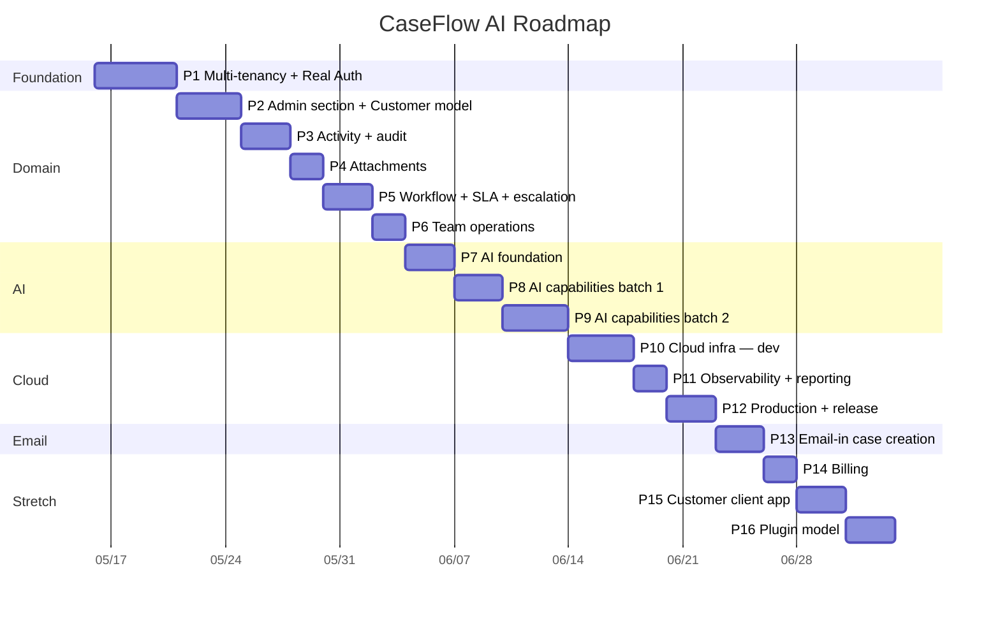

# Roadmap

Source of truth for the build sequence and current status. Updated at the end
of each phase. **Phases are units of work, not calendar days** — actual
elapsed time depends on focus and velocity.

> **Two roadmap files, two jobs.** This file is the phased *execution plan*:
> what we're building, in what order, against what acceptance criteria. The
> sibling [`docs/roadmap.md`](docs/roadmap.md) is the *feature backlog* —
> captured-but-not-scoped ideas (customer-facing client, intake API, seed
> setup, real auth pre-tenancy notes, release-please, husky pre-commit,
> notifications). Items graduate from the backlog into a phase here once
> their open questions are resolved.

---

## Status legend

| ✅ Complete | 🚧 In progress | ⏭️ Next up | ⏸️ Blocked | ⬜ Not started | 🎯 Stretch goal |
|---|---|---|---|---|---|

---

## Current state

**Today:** 2026-05-24 — **P2.4 shipped. P2 open at 4/7. Customer CRUD lands end-to-end on the backend (5 DTOs + service with cross-tenant FK invariant enforcement + composite-unique-violation translation + two controllers in the Pre-flight 12 hybrid URL shape). Frontend ships the read-only `CustomerOrganizations` admin widget — the registry-accumulation payoff promised by P2.1's Pre-flight 2 cashes in (two widgets, one shell, zero `<AdminSection />` edits). Three Pre-flights: 12 (nested + flat URL hybrid), 13 (no DELETE in P2.4 — status enum carries lifecycle), 14 (no primary-contact auto-sync, Pre-flight 10's runtime-binding completion). Two Mid-flights caught during build: 6 (test-store reducer drift — pre-existing test stores broke when `customersReducer` widened RootState) and 7 (proxy / CDN allowlist drift — P1 Mid-flight 9 fired again on `/customers`; lint-rule mitigation now elevated as a P-contributor-framework task).** P2.1 (Admin section foundation) closes today: the `/admin` route is live behind `RequireRole(ADMIN)`, the widget-registry composition primitive from P1.8 was re-used (parallel `adminWidgets` registry, same `Widget` contract), and the first widget — `PendingApprovalUsers` — handles one-click approve / reject against `PATCH /users/:id/status` with optimistic update + rollback. Backend gained `GET /users?status=` admin-gated; frontend gained a `usersSlice` with `createSelector`-memoized `selectPendingApprovalUsers`. Two mid-flights captured along the way: TextEncoder polyfill in `jest.setup.ts` (react-router 6.4+ uses it at module load; jsdom doesn't expose it) and a backend ESLint flat-config repair (missing `globals.node` / `globals.jest`, base `no-undef`/`no-unused-vars` not disabled in favor of TS-aware variants, `varsIgnorePattern: '^_'` for intentional destructured discards). v0.1.0 tag from 2026-05-21 still carries the demo-ready deployed environment at [caseflow.musto.io](https://caseflow.musto.io); the public methodology surface is at [github.com/amusto/caseflow-ai-showcase](https://github.com/amusto/caseflow-ai-showcase). Article 01 (*AI-Ready SDLC — the kickoff*) shipped on LinkedIn 2026-05-20. Decision log carries 27 P1 pre-flights + 11 P1 mid-flights, plus 8 P2 pre-flights + 4 P2 mid-flights. Mid-flight 4 (`void promise.catch(() => undefined)` fire-and-forget pattern) is the project's new standard for any async side-effect dispatched without `await` — applies across notifications, future audit-log writes, and webhook dispatches. P7.7 will spawn its own decision log (pgvector vs. dedicated vector DB, embedding model choice, chunking strategy) when the spec opens.
**Active scope:** 13 / 86 core sub-phases shipped (15%). P1 (Multi-tenancy + Real Auth) is ✅ at 9/9. P2 (Admin section + Customer model) is 🚧 at 4/7 — P2.1 + P2.2 + P2.3 + P2.4 ✅; next: P2.5 (add `customerOrganizationId` FK to `Case` + backfill migration + the demo-seed extension to attach seeded cases to customer orgs). P10 (Cloud infrastructure — dev) is 🚧 — dev environment is live (ECS + RDS + ALB + CloudFront + S3) but a few sub-phases (ai_worker, events, formal e2e, cost guardrails) remain; recommended to weave in just before P7. **AI/RAG scope expanded 2026-05-23** — new sub-phases P7.7 (vector store + embedding pipeline on pgvector), P8.6 (historical case solution search), P9.7 + P9.8 (chat session infrastructure + engineer case assistant panel), and a new core Phase 13 (Email-in case creation with AI-assisted triage). Stretch phases renumbered: Billing P13→P14, Customer client P14→P15, Plugin model P15→P16. Combined scope went from 76+8=84 to 86+8=94 sub-phases. **Recommended order: P2.3 spec + implementation → P2.4+ (customer CRUD)**, with the rest of P2 building on top. **Cross-cutting work in flight:** [`docs/planning/contributor-framework.md`](docs/planning/contributor-framework.md) (husky + commitlint + verify.yml strict spec-gate + deploy.yml via OIDC + branch protection — all decisions resolved, implementation deferred) and [`docs/planning/soc2-readiness.md`](docs/planning/soc2-readiness.md) (Framing A: SOC II-aware SDLC; scope CC/A/C/PI; mapping table + spec-template + verify.yml compliance-check job + three supporting docs identified, implementation deferred). See "Cross-cutting planning" below.
**Last shipped:** **P2.4 — Customer CRUD + `CustomerOrganizations` admin widget (2026-05-24).** Backend ships full CRUD on both entities: 5 DTOs (`CreateCustomerOrganizationDto`, `UpdateCustomerOrganizationDto`, `ListCustomerOrganizationsQueryDto`, `CreateCustomerContactDto`, `UpdateCustomerContactDto`), `CustomersService` with eight methods enforcing Pre-flight 11's cross-tenant FK invariant by reading the parent org's tenantId on contact create, two controllers in Pre-flight 12's hybrid URL shape (`CustomersController` for nested + flat-org routes; `ContactsController` for flat `/contacts/:contactId`). Composite-unique violations on `(tenantId, name)` and `(customerOrganizationId, email)` translate to 409 ConflictException; email lowercased before persist on both contact and org primary-contact-email writes. 41 new backend tests across 3 spec files cover happy paths, cross-tenant 404s, the Pre-flight 11 invariant assertion, and the role-gate (admin-only on writes; reads available to any ACTIVE user). Frontend ships the read-only `CustomerOrganizations` widget — registered in `adminWidgets` alongside `PendingApprovalUsers` with **zero changes to `<AdminSection />`** (the architectural payoff promised by P2.1's Pre-flight 2 cashes here). `customersSlice` ships `fetchCustomersThunk` (RTK condition dedup) + `updateOrgStatusThunk` (optimistic update + rollback, shipped pre-consumer for P2.7) + memoized selectors. Widget caps visible rows at 10 with a "View all" footer (placeholder route until P2.7). 16 frontend tests across the slice + widget. Three Pre-flights captured (12 hybrid endpoint shape, 13 no DELETE in P2.4, 14 no primary-contact auto-sync). **Two Mid-flights captured during build**: 6 (test-store reducer drift — pre-existing `usersSlice.test.ts` + `PendingApprovalUsers.test.tsx` broke when adding `customersReducer` widened RootState; future fix is a `verify.yml` lint rule); 7 (proxy / CDN allowlist drift, P1 Mid-flight 9 strikes again — `/customers` missing from Vite proxy + CloudFront behaviors; both surfaces patched in Chunk C, lint-rule promotion elevated as a contributor-framework task). Spec at [`p2-4-customer-crud.md`](sdlc-roadmap-requirements/docs/tasks/dev-ready/p2-4-customer-crud.md); decision log carries Pre-flights 12–14 + Mid-flights 6–7. **Previously shipped:** P2.3 — CustomerOrganization + CustomerContact entities (2026-05-24). New `backend/src/customers/` folder with the two entities, a `CustomerOrganizationStatus` enum (`ACTIVE` / `INACTIVE`), and a `CustomersModule` shell (empty `providers` + `controllers` — that work belongs to P2.4 per Pre-flight 9's single-module-houses-both-entities decision). Schema: `customer_organizations` carries denormalized `primaryContactName` / `primaryContactEmail` / `primaryContactPhone` columns over an FK into `customer_contacts` (Pre-flight 10 — chicken-and-egg, list-view perf, edit ergonomics), plus a composite `(tenantId, name)` UNIQUE; `customer_contacts` carries denormalized `tenantId` + composite `(customerOrganizationId, email)` UNIQUE (Pre-flight 11 — org-scoped uniqueness allows the consultant-across-orgs case). FK strategy: tenant → orgs and tenant → contacts are `RESTRICT`; org → contacts is `CASCADE`. 14 entity-metadata smoke tests assert column presence, index names + `unique` flag, FK `onDelete` choices, and the postgres `enum` default. Demo seed extended: `customer-organizations.factory.ts` + `customer-contacts.factory.ts` produce 9 orgs (6 ACTIVE + 3 INACTIVE) + 18 contacts across 3 tenants; `SeedService` orchestration extended for FK-safe ordering (wipe: cases → contacts → orgs → users → tenants; insert reversed). **Mid-flight 5 captured during the Chunk B review**: `Layout.tsx` AppBar wordmark wrapped in `<Button component={RouterLink} to="/" color="inherit">` — gives every authenticated user a back-to-home affordance, pairing with P2.1's Admin forward-nav, and documents the "brand-as-home" pattern so future contributors don't re-implement it elsewhere. Pre-flights 9–11 + Mid-flight 5 landed in the phase-02 decision log. **Previously shipped:** P2.2 — Admin notification + customer lifecycle emails (2026-05-23). New backend `NotificationsModule` with Resend as the outbound transport (Pre-flight 5; SES deferred to P12) and a `LogTransport` dev fallback selected by the transport factory when `RESEND_API_KEY` is unset. Three transactional email types ship together (Pre-flight 6 reversed the original admin-only lean): **admin registration alert** fans out to every ACTIVE admin in the new registrant's tenant via dynamic `UsersService.listAdminsByTenant` lookup (Pre-flight 8 — no env-var routing); **customer welcome** on register; **customer approval-granted** on the `PATCH /users/:id/status` PENDING_APPROVAL → ACTIVE transition only. `AuthService.register()` + `googleSignIn()` JIT-create branch fire the admin alert + customer welcome pair; `UsersController.updateStatus` captures previous status and fires approval-granted only on that one positive transition (four negative-transition tests assert no-call). Templates render `{subject, html, text}` with HTML-escape enforced via shared layout helpers — XSS-safe under hostile names. The `UsersModule ↔ NotificationsModule` circular dep is resolved via paired `forwardRef`. **Mid-flight 4 captured during build**: fire-and-forget call sites use `void promise.catch(() => undefined)` rather than bare `void promise` — Node 24's strict unhandled-rejection policy crashes worker processes when a rejected promise has no handler, and the two-layer defense (`void` for the lint rule + `.catch()` for the runtime handler) is now the project standard for any async side-effect dispatched without `await`. Pre-flights 5–8 + Mid-flight 4 landed in the phase-02 decision log. **Previously shipped:** P2.1 — Admin section foundation (2026-05-22): `/admin` route gated by `<RequireRole>`, parallel `adminWidgets` registry, `PendingApprovalUsers` widget with one-click approve + reject (optimistic update + rollback), `GET /users?status=` admin-gated backend endpoint, `usersSlice` with `createSelector` memoization, two mid-flights (TextEncoder polyfill + backend ESLint repair). Contributor framework + SOC II readiness planning docs (2026-05-22 earlier) — design-only, ~12 future dev-ready specs to spawn. Phase 1 close-out (2026-05-20 → 2026-05-21) — tour engine → Engineer Dashboard MVP → demo seed harness → main merge → screenshots → v0.1.0 tag → showcase repo published. Pre-flight 27 (Showcase repo pattern) ties the close-out together.
**Cost reminder:** Dev environment is live on AWS — ECS Fargate (1 task, 0.25 vCPU / 512 MB), RDS db.t4g.micro Postgres, ALB, CloudFront, S3 SPA bucket. ~$30-50/month at idle. Tear down with `terragrunt destroy` in each `infra/live/dev/*` stack if not actively demoing.

---

## Cross-cutting planning

Some work doesn't belong to a single phase — it's foundational tooling or process that touches every phase. These planning docs live under [`docs/planning/`](docs/planning/) and capture the design before any implementation. When promoted, each spawns dev-ready specs that slot into a future phase.

| Doc | Status | What it covers | Decisions resolved | Pending implementation spawns |
|---|---|---|---|---|
| [`contributor-framework.md`](docs/planning/contributor-framework.md) | 📐 Design complete | Onboarding (`CONTRIBUTING.md` + `docs/onboarding/`), branch naming convention, husky + commitlint hooks, `verify.yml` strict spec-linkage gate, `deploy.yml` via GitHub OIDC, PR template, branch protection | 7/7 (D1–D7) | ~5 dev-ready specs |
| [`soc2-readiness.md`](docs/planning/soc2-readiness.md) | 📐 Design complete | Framing A (SOC II-aware SDLC) with B documented as future path. Scope CC + A + C + PI; Privacy excluded. Mapping table from SDLC artifacts to TSCs. Spec-template Compliance impact section. Decision-log TSC tag. `verify.yml` compliance-check job. Three supporting docs identified: `audit-logging.md`, `secret-rotation.md`, `access-review.md`. | 5/5 (D1–D5) + 8 open | ~7 dev-ready specs |
| [`jira-integration.md`](docs/planning/jira-integration.md) | 📌 Placeholder | Reserved slot. Five possible framings surfaced (internal SDLC tracking, customer-facing workflow, AI context source, plugin reference template, bidirectional sync). Activation triggers + open questions captured. No design committed. | 0/0 (framing TBD) | TBD on activation |

**When these promote into phase work:** Both docs include §11 promotion paths. The contributor framework is a near-term candidate (sequenced as a tooling sub-phase at the front of P2 or as a dedicated P2.0). The SOC II hooks layer on top of the contributor framework and are best slotted as a compliance-overlay sub-phase between P2 and P3, OR distributed across P2/P3/P4 as each touches more SOC II-relevant surface (auth in P2.1-2.2, audit-log table in P3, attachments/encryption in P4).

**Why this lives at the roadmap level:** These aren't features — they're how every feature gets built. Burying them in a phase would obscure that they affect all phases. Treating them as cross-cutting also matches how SOC II auditors think — they look for systemic controls, not phase-by-phase compliance.

---

## Progress

### Overall

```
Core (P1-P13):      [███░░░░░░░░░░░░░░░░░]  15%  (13 / 86 sub-phases)
Stretch (P14-P16):  [░░░░░░░░░░░░░░░░░░░░]   0%  ( 0 /  8 sub-phases)
Combined:           [███░░░░░░░░░░░░░░░░░]  14%  (13 / 94 sub-phases)
```

> **Core** is the MVP — what reviewers expect to see to call the project
> defensible: a multi-tenant case-management SaaS with the AI capabilities
> the product vision calls for, deployed end-to-end to a dev environment
> and a prod environment, with audit + observability. **Stretch** is what
> ships only if there's time and a specific audience demand. The
> core/stretch split keeps progress honest: "what's required to defend
> the project" stays separated from "what's nice to have."

### By phase

| # | Phase | Bar | % | Sub-phases | Status |
|---|---|---|---|---|---|
| 1 | Multi-tenancy + Real Auth foundation       | `██████████` | 100% | 9/9 | ✅ |
| 2 | Admin section + Customer model             | `█████░░░░░` | 57% | 4/7 | 🚧 |
| 3 | Activity, collaboration, audit             | `░░░░░░░░░░` | 0% | 0/6 | ⬜ |
| 4 | Attachments & documents                    | `░░░░░░░░░░` | 0% | 0/5 | ⬜ |
| 5 | Workflow engine: status, SLA, escalation   | `░░░░░░░░░░` | 0% | 0/6 | ⬜ |
| 6 | Team operations                            | `░░░░░░░░░░` | 0% | 0/5 | ⬜ |
| 7 | AI foundation (incl. vector store)         | `░░░░░░░░░░` | 0% | 0/7 | ⬜ |
| 8 | AI capabilities — batch 1 + search         | `░░░░░░░░░░` | 0% | 0/6 | ⬜ |
| 9 | AI capabilities — batch 2 + chatbot        | `░░░░░░░░░░` | 0% | 0/8 | ⬜ |
| 10 | Cloud infrastructure — dev                | `░░░░░░░░░░` | 0% | 0/9 | ⬜ |
| 11 | Observability + operational reporting     | `░░░░░░░░░░` | 0% | 0/6 | ⬜ |
| 12 | Production environment + release readiness| `░░░░░░░░░░` | 0% | 0/6 | ⬜ |
| 13 | Email-in case creation                    | `░░░░░░░░░░` | 0% | 0/6 | ⬜ |
| 14 | Subscription & billing readiness (stretch)| `░░░░░░░░░░` | 0% | 0/3 | 🎯 |
| 15 | Customer-facing client app (stretch)      | `░░░░░░░░░░` | 0% | 0/3 | 🎯 |
| 16 | Plugin/module model + templates (stretch) | `░░░░░░░░░░` | 0% | 0/2 | 🎯 |

### Gantt — phases on a timeline

GitHub renders this Mermaid block inline. For LinkedIn/decks, export with
`mmdc -i ROADMAP.md -o roadmap.png` or screenshot the rendered version.



### Phase × Requirements matrix

Maps each phase to the [`CLAUDE.md`](CLAUDE.md) operating principles and "Do
Not" rules it specifically demonstrates. This is the requirements-alignment
view: progress isn't just "code shipped" — it's "contract clauses honored."

| Phase | Status | CLAUDE.md operating principles satisfied | CLAUDE.md "Do Not" rules satisfied | Notes |
|---|---|---|---|---|
| P1  | ✅ | #4 (DTO/validation at auth boundary), #5 (no bypassing authorization or role checks) | #1 (no silently weakening validation), #3 (no hard-coded secrets — JWT/OAuth secrets from env), #4 (no global mutable state in tenant context) | Foundational: every later phase inherits tenant scoping |
| P2  | ⬜ | #4 (DTO validation on customer endpoints) | #5 (no skipping error handling on orphan-customer business rule) | Cases now FK to customer org |
| P3  | ⬜ | #4 (DTO for notes; visibility validated at boundary), #6 (tests for note RBAC) | #1 | Internal-vs-customer-visible enforced server-side |
| P4  | ⬜ | #4 (file-type/size validation), #6 | #1, #3 (S3 creds via env or IAM role) | Local dev uses MinIO/filesystem; real S3 lands in P10 |
| P5  | ⬜ | #4 (illegal-transition rejection), #6 (tests for state-machine + SLA clock) | #5 (business-rule error handling for illegal transitions) | State machine + SLA clock are pure domain logic |
| P6  | ⬜ | #4 (assignment-strategy inputs), #6 | #4 (routing strategy via DI, not global) | Workload metrics drive routing |
| P7  | ⬜ | #4 (Zod-validated AI tool calls), #6, #8 (Bedrock/OpenAI deps justified in decision log) | #3 (provider keys from Secrets Manager / env), #4 (provider via DI) | Platform, not feature; no user-visible AI yet |
| P8  | ⬜ | #4, #5 (AI output gated by human approval), #6 | #1 (validation around AI-generated content), #5 | Summarization + suggested resolutions |
| P9  | ⬜ | #4, #5, #6 | #1, #5 | Five more AI capabilities through the same gate |
| P10 | ⬜ | #7 (validation commands include `terraform fmt`/`validate`, `terragrunt hclfmt`), #8 (every AWS resource type justified) | #3 (zero secrets in TF), #6 (no rogue third app surface), #7 (architecture changes happen via phase spec) | First real cloud deploy; account-guard precondition prevents wrong-account applies |
| P11 | ⬜ | #6 (chaos-drill tests for alarm paths), #7 | — | Dashboards + alarms + operational reporting |
| P12 | ⬜ | #7, #11 (Conventional Commits drive release-please) | #3 (prod secrets in Secrets Manager, never in TF) | Prod environment + release automation |
| P13 | ⬜ | #4 (DTO validation on inbound webhook payload), #5 (no auto-applied AI; engineer approval gates draft→OPEN), #6 (tests for cross-tenant routing safety) | #1 (validation around AI-generated triage), #3 (Resend webhook secret via Secrets Manager), #5 (auditable triage trail) | Inbound email → draft case w/ AI-assisted triage |
| P14 🎯 | ⬜ | #4 (Stripe webhooks validated; idempotency keyed on event id) | #3, #5 | Optional stretch — pulls in only if SaaS billing is needed |
| P15 🎯 | ⬜ | #1, #6 | #6 (separate workspace introduced **with** confirmation) | Customer-facing client; deliberate "Do Not #6" exception |
| P16 🎯 | ⬜ | #1, #7 | #7 (plugin model is the architecture change, not a refactor) | Plugin/module + industry templates |

**Legend.** Operating principles and "Do Not" rules are numbered per the
root [`CLAUDE.md`](CLAUDE.md). The matrix is additive — once a clause is
satisfied by an earlier phase, later phases inherit and must not violate it.

## Notation

- **P\<N\>** — phase number (e.g., P2)
- **P\<N\>.\<M\>** — sub-phase within a phase (e.g., P1.2 = second deliverable of Phase 1)
- **Day N (YYYY-MM-DD)** — calendar day reference in the daily log
- Each phase below numbers its sub-phases so the daily log can reference them
  precisely (`Day 3 (2026-05-18) — completed P2.1, started P2.2`).

---

## Phases at a glance

| # | Phase | Status | Primary deliverable | Decision log |
|---|---|---|---|---|
| 1  | Multi-tenancy + Real Auth foundation | ✅ (9/9) | ✅ Tenant entity · ✅ real auth (bcrypt + JWT + refresh tokens + admin approval + default tenant) · ✅ Google OAuth + JIT · ✅ JwtAuthGuard + ActiveUserGuard (global) · ✅ tenant-scoped queries · ✅ frontend login + session bootstrap · ✅ tour engine · ✅ Engineer Dashboard MVP · ✅ demo seed harness | [`docs/decisions/phase-01-multi-tenancy-auth.md`](docs/decisions/phase-01-multi-tenancy-auth.md) |
| 2  | Admin section + Customer model | 🚧 (4/7) | ✅ `/admin` route + widget-registry reuse · ✅ `PendingApprovalUsers` widget · ✅ `NotificationsModule` (Resend) + admin alert + customer welcome + approval-granted · ✅ `CustomerOrganization` + `CustomerContact` entities + demo-seed extension · ✅ customer CRUD endpoints (both entities, ADMIN-gated writes) + `CustomerOrganizations` admin widget · cases FK to customer org · frontend customer list/detail | [`docs/decisions/phase-02-admin-and-personalization.md`](docs/decisions/phase-02-admin-and-personalization.md) |
| 3  | Activity, collaboration, audit | ⬜ | Notes (internal vs customer-visible) · extended timeline · compliance-grade AuditLog table · frontend timeline + note composer | _pending_ |
| 4  | Attachments & documents | ⬜ | Attachment entity · presigned-URL flow · local-dev MinIO/filesystem (real S3 deferred to P10) · upload UI | _pending_ |
| 5  | Workflow engine: status, SLA, escalation | ⬜ | Status state machine · SLA clock + breach detection · data-driven escalation rules · frontend SLA badge | _pending_ |
| 6  | Team operations | ⬜ | Queue entity · routing strategies (round-robin / skill / workload) · workload dashboard | _pending_ |
| 7  | AI foundation (incl. vector store) | ⬜ | AiProvider interface · Bedrock + OpenAI adapters · versioned Prompt entity · AiInvocation audit log · SQS queue + worker pattern (local) · **pgvector + RetrievalService (RAG foundation)** | _pending_ |
| 8  | AI capabilities — batch 1 + search | ⬜ | Case summarization · suggested resolutions · human-approval gate · AI insight panel on case detail · **historical case solution search** | _pending_ |
| 9  | AI capabilities — batch 2 + chatbot | ⬜ | Next actions · escalation risk · sentiment · priority scoring · duplicate detection (all approval-gated) · **chat session infra + engineer case assistant panel** | _pending_ |
| 10 | Cloud infrastructure — dev | ⬜ | Terraform/Terragrunt: buckets · rds_postgres · backend_ecr · backend_ecs · frontend_cdn · ai_worker · events · observability · end-to-end smoke test | _pending_ |
| 11 | Observability + operational reporting | ⬜ | CloudWatch dashboard · error/SLA/AI-queue alarms · operational reporting endpoints + frontend views | _pending_ |
| 12 | Production environment + release readiness | ⬜ | `live/prod/` stacks · multi-AZ RDS · WAF · release-please · CI/CD deploys · runbooks | _pending_ |
| 13 | Email-in case creation | ⬜ | Resend Inbound webhook · MIME parsing + attachment streaming · sender matching · AI-assisted triage (similar cases, summary, priority) · draft case workflow with engineer review | _pending_ |
| 14 | Subscription & billing readiness (stretch) | 🎯 | Stripe wiring · plan limits · usage metering | _pending_ |
| 15 | Customer-facing client app (stretch) | 🎯 | New `client/` workspace · magic-link auth · file-a-case + view-my-cases | _pending_ |
| 16 | Plugin/module model + industry templates (stretch) | 🎯 | Plugin interface · two reference templates (e.g., gov-contractor support, SaaS-team escalations) | _pending_ |

---

## Phase 1 — Multi-tenancy + Real Auth foundation ✅

**Goal.** Make CaseFlow AI tenant-aware and replace the demo auth with
real auth. Every existing case query gets scoped by tenant; no path in the
codebase can read another tenant's data even with a valid auth token from
a different tenant. Frontend gets a real login.

**Sub-phases & deliverables:**
- ✅ **P1.1** `Tenant` entity + `tenantId` FK on `Case` + `CaseHistory`. Shared `databaseConfig` helper. Mid-flight 1 flipped to `synchronize: true` for dev velocity; reference migration preserved at `docs/reference/migrations/`. Mid-flight 2 pinned typeorm via root `resolutions` to fix dual-install TS2322.
- ✅ **P1.2** `User` entity + real auth — bcrypt + JWT access token (15m) + opaque refresh token (7d, rotated on use). `AuthService.{register, login, refresh, logout}`. `UsersService` with hash-on-create. `PATCH /users/:id/status` admin endpoint. Default tenant ("ABC Company") seeded via `TenantsService.onModuleInit` (Pre-flight 9). PENDING_APPROVAL users CAN log in but tokens carry `status` claim (Pre-flight 8 revised). Mid-flight 4 flipped `databaseConfig` to function form so env reads happen after ConfigModule loads `.env`. Mid-flight 6 documented Bearer-in-body now / httpOnly-cookie-for-refresh switch scheduled for P1.6.
- ✅ **P1.3** Google OAuth with **JIT provisioning** — `POST /auth/google` accepts a Google ID token, verifies signature, creates the user record on first sign-in with `role=CUSTOMER` default. Backend `GoogleVerifier` wraps `google-auth-library.verifyIdToken` (Pre-flight 22: JWKS, signature, audience, issuer, expiry all handled in-library). `googleSignIn` flow: verify → findByGoogleSub → findByEmail (link) → createUserFromGoogle (JIT). Frontend uses `@react-oauth/google` `GoogleLogin` button, conditionally rendered when `VITE_GOOGLE_CLIENT_ID` is set.
- ✅ **P1.4** `JwtAuthGuard` + `ActiveUserGuard` registered globally as `APP_GUARD` (Pre-flight 10). `@Public()` decorator opt-out on `/auth/*`. `@CurrentUser()` parameter decorator replaces `@Request() req` in controllers. `MockUserGuard` retained behind `USE_MOCK_USER_GUARD` env flag (Pre-flight 11). Cases + Users controllers refactored to drop per-controller guards.
- ✅ **P1.5** `CasesService` scopes every query by `tenantId`. Cross-tenant access returns 404 (Pre-flight 12). Latent NOT-NULL bug from P1.1 fixed: `create` + `recordHistory` now stamp tenantId. Mid-flight 7 fixed a TypeORM `@JoinColumn` naming bug across four entities (snake_case vs camelCase phantom dual columns).
- ✅ **P1.6** Frontend: login page (basic + Google), auth state in Redux Toolkit slice, axios client interceptor adds bearer token + auto-refresh on 401. Three route wrappers: `PublicOnly` (auth'd users bounce out), `RequireAuth` (any auth state), `RequireActiveAuth` (ACTIVE only). `PENDING_APPROVAL` users land on `/awaiting-approval`. Mid-flight 6 hybrid-cookie transport: httpOnly refresh cookie (`Path=/auth`, `SameSite=Strict`, `Secure` in prod), access token in Redux only. Mid-flight 8 session bootstrap: `App.tsx` dispatches `refreshThunk` on mount and gates `<Routes>` render until resolution, keeping users signed in across page reloads.
- ✅ **P1.7** **Internal-only tour infrastructure** — react-joyride-based tour engine, `data-tour-id` DOM convention, declarative tour definitions under `frontend/src/tours/`, `<TourEngine />` mounted inside `<Layout />` (gated to `ENGINEER` + `ADMIN` roles, never renders for `CUSTOMER`). `UserTourState` entity persists completion + version per user; `GET /tour-state` + `POST /tour-state` endpoints. First onboarding tour walks the post-login surface in 4 steps. Mid-flight 9 captured the proxy-allowlist-drift footgun: every new backend resource needs a Vite proxy entry AND a CloudFront ordered behavior — three touchpoints (NestJS controller + Vite proxy + CloudFront behavior). See Pre-flight 23 + Mid-flight 9.
- ✅ **P1.8** **Engineer Dashboard MVP** — widget-composed dashboard at `/` for `ENGINEER` + `ADMIN`. Widget contract `{ id, title, audience, Component }` in `frontend/src/features/dashboard/`. MVP ships three widgets: `QuickActions` (Create-case dialog placeholder + stubbed search), `MyOpenCases` (priority + age sort), `RecentActivity` (5 most-recently-updated cases). Shared `casesSlice` ensures the dashboard fires `GET /cases` exactly once regardless of widget count. `DashboardRouter` switches `/` between Dashboard and the existing `<Home />` placeholder based on role. Onboarding tour re-anchored to dashboard widgets (v2). Mid-flight 10 captured the RTK thunk-dedup-via-condition pattern and the global Express etag disable. See Pre-flight 24 + Mid-flight 10.
- ✅ **P1.9** **Demo seed harness** — backend `seed/` module (`backend/src/seed/`) with TenantsFactory + UsersFactory + CasesFactory orchestrated by `SeedService`. CLI entrypoint via `yarn db:seed:demo` (standalone Nest application context — no HTTP server). Deterministic UUID v5 (manual implementation, zero deps) is the idempotency mechanism: same hashing names a row AND identifies it for wipe-and-reinsert. Hand-curated dataset — 35 case archetypes, 30 realistic full names (no role prefixes) — keeps screenshots stable across re-seeds. `scripts/dev.sh demo:seed/demo:reset/demo:credentials` wrap the workflow; RDS target reuses the temp-public-access trap-cleanup pattern from `db:promote-rds`. Defense-in-depth production guards (CLI flag confirmation, `NODE_ENV=production` refusal, dev-account-only RDS). 23 unit tests including 3 pinned-UUID regression assertions. See Pre-flight 25 + Pre-flight 26.

**Acceptance criteria:**
- [x] Two seeded tenants exist; a user from Tenant A authenticated with a valid JWT cannot read Tenant B's cases (returns 404, not 403, to avoid leaking existence).
- [x] Basic auth + Google OAuth both produce a usable JWT.
- [x] `MockUserGuard` is dev-only behind `USE_MOCK_USER_GUARD` env flag (default off; explicit `false` in prod terragrunt).
- [x] Frontend can log in via both methods and lands on the case list scoped to the user's tenant.
- [x] Unit tests cover: login success/failure, JWT expiry rejection, cross-tenant read attempt, RBAC denial for `CUSTOMER` trying to access engineer endpoints.
- [x] **P1.7** — Tour engine renders for `ENGINEER` + `ADMIN`; never renders for `CUSTOMER` (asserted in tests + verified in deployed env). First onboarding tour walks the post-login surface end-to-end. `UserTourState` records completion + version per user, syncs across devices.
- [x] **P1.8** — `/` route renders the Engineer Dashboard with `myOpenCases`, `recentActivity`, and `quickActions` widgets for `ENGINEER` + `ADMIN` (verified locally). Empty states designed for every widget. `CUSTOMER` users continue to land on the existing `<Home />` placeholder (formalized in P15 — Customer-facing client app, stretch). Onboarding tour re-anchored to dashboard widgets at version 2.
- [x] **P1.9** — `dev.sh demo:seed` populates a deterministic 3-tenant dataset locally; `dev.sh demo:seed --target=rds` (with confirmation prompt) populates the deployed dev environment. `dev.sh demo:reset` re-runs cleanly. Seed refuses to run with `NODE_ENV=production`. Verified locally with realistic-name display in the dashboard welcome heading.

**Resolved pre-flight decisions** (full text in [`docs/decisions/phase-01-multi-tenancy-auth.md`](docs/decisions/phase-01-multi-tenancy-auth.md)):

1. JWT secret source = `process.env.JWT_SECRET` via `ConfigService`; Secrets Manager in P10.
2. Tenant resolution = JWT claim only; subdomain deferred.
3. Existing dev DB = wipe and re-seed; `tenantId` NOT NULL from migration #1.
4. TypeORM mode = (originally) `synchronize: false`, reversed to `synchronize: true` for dev velocity in Mid-flight 1.
5. JWT lifetime = 15m access + 7d refresh (opaque, hashed, rotated).
6. Password policy = `@MinLength(8)`, no composition rules.
7. Registration scope = open self-service + email globally unique.
8. Admin-approval gate = login allowed for PENDING; data access gated by `ActiveUserGuard` (revised same day from "block login outright").
9. Default tenant = "ABC Company" auto-attached on registration.
10. Guard application = global `APP_GUARD` with `@Public()` opt-out.
11. `MockUserGuard` retained behind `USE_MOCK_USER_GUARD` env flag (default off).
12. Cross-tenant access response = 404 (not 403) — avoids existence-leak.
13. Vite proxy for same-origin cookie posture (P1.6).
14. Status-based routing — `PublicOnly` / `RequireAuth` / `RequireActiveAuth` (P1.6).
15. POC deploy target = us-east-1, default account, `personal` AWS CLI profile.
16. CloudFront default URL (no custom domain) for first deploy — superseded by Pre-flight 19.
17. Database + JWT secrets land in AWS Secrets Manager.
18. Manual `docker push` for first image; CI/CD deferred to P12.
19. Custom domain = `caseflow.musto.io` via existing `*.musto.io` ACM wildcard (supersedes Pre-flight 16).
20. Google sign-in links to existing email-password user (P1.3).
21. Google-registered users land in `PENDING_APPROVAL` (consistent with Pre-flight 8 revised).
22. Token verification via `google-auth-library` (handles JWKS, signature, audience, issuer, expiry).
23. Tour engine = react-joyride + `data-tour-id` DOM convention + source-controlled tour definitions + server-side `UserTourState` (P1.7). Internal-only — never renders for `CUSTOMER`.
24. Engineer Dashboard = widget-registry composition at `/` route, MVP ships `myOpenCases` + `recentActivity` + `quickActions` (P1.8). Each subsequent phase adds widgets.
25. Demo seed = deterministic, idempotent, multi-tenant; entry points `yarn db:seed:demo` + `dev.sh demo:seed`; refuses to run with `NODE_ENV=production` (P1.9).
26. User identity display fields (`name`, `email`) ride as additional JWT claims rather than a separate `/users/me` endpoint — Path A from the JWT-vs-fetch trade-off, defensible for a portfolio MVP. Revisit when profile data grows past name/email or regulatory context demands PII off-token (P1.8 follow-on).
27. **Showcase repo pattern over fully-public main repo.** Implementation repo (`caseflow-ai`) stays private; curated public companion at [`caseflow-ai-showcase`](https://github.com/amusto/caseflow-ai-showcase) carries the methodology surface — ROADMAP, decision log, dev-ready specs, AI-Ready SDLC graphic, articles as they ship, screenshots. The split mirrors how serious orgs share design docs and postmortems without exposing source. A 5-minute "sync methodology artifacts" ritual at each phase close-out keeps the showcase fresh. Rejects (a) fully-public main repo (audience reads READMEs and decisions, not `git log`; senior engineers are evaluated on judgment, not code style) and (b) a day-one `docs/patterns/` excerpts folder in the showcase (deferred — revisit if recruiters consistently ask "can I see a representative code shape?") (P1 close-out, 2026-05-21).

**Mid-flight reversals/fixes captured in the same log:**

1. Reverted Pre-flight 4 to `synchronize: true` for dev velocity.
2. Pinned `typeorm` via root `resolutions` to fix dual-install TS2322.
3. Removed unused migration scaffolding (moved migration to `docs/reference/`).
4. Flipped `databaseConfig` to function form to fix config-load-order trap.
5. (skipped — number never assigned).
6. Documented Bearer-in-body now, httpOnly cookie for refresh in P1.6.
7. Aligned `@JoinColumn` names with `@Column` property names across four entities.
8. Session bootstrap pattern — `App.tsx` fires `refreshThunk` on mount and gates `<Routes>` render until resolution, keeping users signed in across page reloads (post-P1.3 regression fix).
9. Vite proxy + CloudFront behavior allowlist drift — every new backend resource needs a Vite proxy entry AND a CloudFront ordered behavior; missing either causes silent 200-with-HTML or 404 failures. Three-touchpoint rule going forward (P1.7).
10. RTK thunk dedup belongs in `condition`, not the body (the body sees post-pending state); Express's global etag generation disabled to eliminate mystery 304 responses (P1.8).
11. CloudFront path patterns for API routes use `/resource*`, not `/resource/*` — the slash-asterisk form leaves bare-collection endpoints unrouted, falling through to the SPA fallback. All four ordered behaviors corrected (P1.8 post-deploy).

**Dependencies:** None (foundation phase).

**Where to look:**

- [`docs/decisions/phase-01-multi-tenancy-auth.md`](docs/decisions/phase-01-multi-tenancy-auth.md) — 27 pre-flights + 11 mid-flights, every architectural choice + reversal captured
- [`sdlc-roadmap-requirements/docs/tasks/dev-ready/p1-1-tenant-entity.md`](sdlc-roadmap-requirements/docs/tasks/dev-ready/p1-1-tenant-entity.md)
- [`sdlc-roadmap-requirements/docs/tasks/dev-ready/p1-2-user-auth.md`](sdlc-roadmap-requirements/docs/tasks/dev-ready/p1-2-user-auth.md)
- [`sdlc-roadmap-requirements/docs/tasks/dev-ready/p1-3-google-oauth.md`](sdlc-roadmap-requirements/docs/tasks/dev-ready/p1-3-google-oauth.md)
- [`sdlc-roadmap-requirements/docs/tasks/dev-ready/p1-4-jwt-auth-guard.md`](sdlc-roadmap-requirements/docs/tasks/dev-ready/p1-4-jwt-auth-guard.md)
- [`sdlc-roadmap-requirements/docs/tasks/dev-ready/p1-5-tenant-scoped-cases.md`](sdlc-roadmap-requirements/docs/tasks/dev-ready/p1-5-tenant-scoped-cases.md)
- [`sdlc-roadmap-requirements/docs/tasks/dev-ready/p1-6-frontend-login.md`](sdlc-roadmap-requirements/docs/tasks/dev-ready/p1-6-frontend-login.md)
- [`sdlc-roadmap-requirements/docs/tasks/dev-ready/p1-7-tour-infrastructure.md`](sdlc-roadmap-requirements/docs/tasks/dev-ready/p1-7-tour-infrastructure.md)
- [`sdlc-roadmap-requirements/docs/tasks/dev-ready/p1-8-engineer-dashboard.md`](sdlc-roadmap-requirements/docs/tasks/dev-ready/p1-8-engineer-dashboard.md)
- [`sdlc-roadmap-requirements/docs/tasks/dev-ready/p1-9-demo-seed-harness.md`](sdlc-roadmap-requirements/docs/tasks/dev-ready/p1-9-demo-seed-harness.md)
- [`scripts/dev.sh`](scripts/dev.sh) — full-stack smoke test + demo seed wrappers
- [Live demo](https://caseflow.musto.io) — register-and-approve flow
- [Public showcase repo](https://github.com/amusto/caseflow-ai-showcase) — methodology surface (ROADMAP, decisions, specs, articles, screenshots)

---

## Phase 2 — Admin section + Customer model ⬜

**Goal.** Two interleaved themes. **Admin section** — a new `/admin` surface (gated to ADMIN role) that becomes the home for everything operator-facing as the product matures; the first iteration handles user approval + the first email notification (admin awareness when new users register). **Customer model** — the existing P2 scope: introduce customer organizations, link cases to them, give engineers a customer-list / customer-detail surface.

The two themes are sequenced — Admin section lands first so subsequent customer-related admin features (P2.4+) have a home to land in. The widget-registry pattern from P1.8 carries forward to the admin dashboard, demonstrating that the registry is a reusable composition primitive, not a one-off.

**Sub-phases & deliverables:**

*Admin theme (P2.1 + P2.2):*
- ✅ **P2.1** **Admin section foundation** (shipped 2026-05-22). New `/admin` route gated by `<RequireRole role="ADMIN" />` (a fresh outlet wrapper alongside `<RequireAuth />` and `<RequireActiveAuth />`). Widget-registry composition reused from P1.8 — `adminWidgets: ReadonlyArray<Widget>` parallel to `allWidgets`, sharing the `Widget` contract via re-export from `@/features/dashboard/types`. First widget `PendingApprovalUsers` lists `PENDING_APPROVAL` users in the admin's tenant with one-click Approve + Reject (Reject opens a confirmation dialog); both dispatch `updateUserStatusThunk` which optimistically removes the row from `selectPendingApprovalUsers` and rolls back on failure with a snackbar. Backend gained `GET /users?status=` admin-gated (`actor.role === 'ADMIN'`, returns `SafeUser[]`), `ListUsersQueryDto` (class-validator `@IsEnum(UserStatus)`), and `listByTenant(tenantId, { status? })` on `UsersService`. Frontend gained `usersApi`, `usersSlice` (`fetchUsersThunk` with RTK `condition` dedup + `updateUserStatusThunk` with `pendingStatusChanges` rollback map), and `createSelector`-memoized `selectPendingApprovalUsers`. Admin nav button in `Layout.tsx` appears only when `user.role === 'ADMIN'`. Two mid-flights captured during the build: TextEncoder polyfill (`jest.setup.ts`) for react-router 6.4+ under jsdom; backend ESLint flat-config repair (added `globals.node` / `globals.jest`, disabled base `no-undef`/`no-unused-vars` in favor of TS-aware variants, `varsIgnorePattern: '^_'`).
- ✅ **P2.2** **Admin notification on user registration + customer lifecycle emails** (shipped 2026-05-23). `NotificationsModule` in backend with Resend transport (Pre-flight 5: SES deferred to P12) and a `LogTransport` dev fallback selected by the transport factory when `RESEND_API_KEY` is unset. Three transactional email types shipped together (Pre-flight 6 — reversing the original "admin-only, defer customer emails" lean): admin registration alert fans out to every ACTIVE admin in the new user's tenant via dynamic lookup (Pre-flight 8 — `UsersService.listAdminsByTenant`, no env-var routing); customer welcome on register; customer approval-granted on `PATCH /users/:id/status` PENDING_APPROVAL → ACTIVE transition only. `AuthService.register()` and the `googleSignIn()` JIT-create branch fire the admin alert + customer welcome pair; `UsersController.updateStatus` captures previous status and fires approval-granted only on the one positive transition (four negative-transition tests assert no-call). Templates are pure functions returning `{subject, html, text}` — table-based HTML with HTML-escaping enforced via a shared layout helper (XSS-safe even when registrants submit hostile names). The `UsersModule ↔ NotificationsModule` circular dependency is resolved via paired `forwardRef` on both modules + constructor-level `@Inject(forwardRef(...))` in `UsersController` and `NotificationsService`. **Mid-flight 4 captured during build**: fire-and-forget call sites use `void promise.catch(() => undefined)` rather than bare `void promise` — Node 24's strict unhandled-rejection policy crashes worker processes when a rejected promise has no handler, and the two-layer defense (`void` for the lint rule + `.catch()` for the runtime handler) survives any future contract violation inside `NotificationsService`. Spec at [`p2-2-admin-notification.md`](sdlc-roadmap-requirements/docs/tasks/dev-ready/p2-2-admin-notification.md); decision log carries Pre-flights 5–8 + Mid-flight 4.

*Customer model theme (P2.3 → P2.7):*
- ✅ **P2.3** **CustomerOrganization + CustomerContact entities** (shipped 2026-05-24). New `backend/src/customers/` folder with the two entities, a `CustomerOrganizationStatus` enum (`ACTIVE` / `INACTIVE`), and a `CustomersModule` shell — empty `providers` + `controllers` per Pre-flight 9's single-module-houses-both-entities choice; CRUD lands in P2.4 where it can be reviewed alongside DTOs + service-layer tests. Schema: `customer_organizations` carries denormalized `primaryContactName` / `primaryContactEmail` / `primaryContactPhone` columns over an FK into `customer_contacts` (Pre-flight 10 — chicken-and-egg between org create and first contact, list-view perf, separate edit ergonomics), plus a composite `(tenantId, name)` UNIQUE so one tenant cannot have duplicate org names. `customer_contacts` carries denormalized `tenantId` (matches the `cases` / `users` pattern) + composite `(customerOrganizationId, email)` UNIQUE (Pre-flight 11 — org-scoped, not tenant-scoped or global; the same address can legitimately exist as a contact under two different customer orgs but not twice under the same org). FK strategy: tenant → orgs and tenant → contacts are `RESTRICT`; org → contacts is `CASCADE` (orphan contacts are nonsense). 14 entity-metadata smoke tests assert column presence, index names + `unique` flag, FK `onDelete` choices, and the postgres `enum` default. Demo seed extended (P1.9 follow-up): `customer-organizations.factory.ts` + `customer-contacts.factory.ts` produce 9 orgs (6 ACTIVE + 3 INACTIVE, one INACTIVE per tenant so P2.7's case-creation picker filter has a real "should not appear" target) + 18 contacts (distributed 3+2+1 per tenant to mix the "many contacts" and "single primary" UI cases). `SeedService` orchestration extended for FK-safe ordering — wipe: cases → contacts → orgs → users → tenants; insert reversed. **Mid-flight 5 captured during build**: `Layout.tsx` AppBar wordmark wrapped in `<Button component={RouterLink} to="/" color="inherit">` — gives every authenticated user a back-to-home affordance, pairing with P2.1's Admin forward-nav. Documents the "brand-as-home" pattern so future contributors don't re-implement it in their own sub-pages. Spec at [`p2-3-customer-entities.md`](sdlc-roadmap-requirements/docs/tasks/dev-ready/p2-3-customer-entities.md); decision log carries Pre-flights 9–11 + Mid-flight 5.
- ✅ **P2.4** **Customer CRUD + `CustomerOrganizations` admin widget** (shipped 2026-05-24). Backend ships full CRUD on both entities: 5 DTOs covering create / update / list, `CustomersService` with 8 methods owning both entities, and two controllers in Pre-flight 12's hybrid URL shape — `CustomersController` for `/customers` + `/customers/:orgId/contacts` (nested for parent-context), `ContactsController` for `/contacts/:contactId` (flat for individual-contact ops). Pre-flight 11's cross-tenant FK invariant gets enforced here: `createContact` reads the parent org's tenantId via a tenant-scoped lookup, then stamps the resolved tenant onto the contact — the actor cannot reach an org in another tenant, so the contact can never be inserted with a mismatched tenantId. Composite-unique violations on `(tenantId, name)` and `(customerOrganizationId, email)` translate to 409 ConflictException via service-layer catch + re-throw. Email lowercased before persist on both contact and org primary-contact-email writes. ADMIN-only on writes; reads available to any ACTIVE user (engineers will need read access in P2.5 for case-creation form). **No DELETE endpoint in P2.4** (Pre-flight 13 — status `INACTIVE` covers the lifecycle until P2.5 settles the case-FK story). 41 new backend tests cover happy paths, cross-tenant 404s, the Pre-flight 11 invariant, the role gate, and the unique-violation translation path. Frontend ships the read-only `CustomerOrganizations` widget — registered in `adminWidgets` alongside `PendingApprovalUsers` **with zero changes to `<AdminSection />`'s shell** (P2.1 Pre-flight 2's promised registry-accumulation payoff). `customersSlice` ships `fetchCustomersThunk` (RTK condition dedup) + `updateOrgStatusThunk` (optimistic update + rollback, shipped pre-consumer for P2.7) + memoized `selectActiveCustomerOrgs` + `selectAllCustomerOrgs`. Widget caps visible rows at 10 with a "View all (N) →" overflow footer routing to placeholder `/customers` until P2.7. 16 new frontend tests across slice + widget. **Mid-flight 6 captured during build**: test-store reducer drift — adding `customersReducer` to the production store widened `RootState` and broke two pre-existing test files that built local stores without the new reducer; fix is mechanical (add the reducer to each drifted test store) but the recurring nature elevates the contributor-framework's planned `verify.yml` test-store lint check as a real future task. **Mid-flight 7 captured during build**: proxy / CDN allowlist drift — P1 Mid-flight 9 fired again on `/customers` (and would have fired on `/contacts` in deployed environments); patched both Vite proxy + CloudFront ordered behaviors for `/customers*` and `/contacts*`; the recurrence under existing inline-comment mitigation elevates the contributor-framework's planned `verify.yml` controller-vs-proxy-vs-CDN lint check as a real future task. Spec at [`p2-4-customer-crud.md`](sdlc-roadmap-requirements/docs/tasks/dev-ready/p2-4-customer-crud.md); decision log carries Pre-flights 12–14 + Mid-flights 6–7.
- ⬜ **P2.5** Add `customerOrganizationId` FK to `Case`. Backfill migration for any P1-era seeded cases. Validation rejects case creation with no customer org. Demo seed harness (P1.9) extends to attach seeded cases to customer orgs.
- ⬜ **P2.6** Tests: customer CRUD happy path + tenant isolation (Tenant A cannot read Tenant B's customers); case creation rejected without customer org; notification fires exactly once per new registration; admin-only routes return 403 for non-admin users.
- ⬜ **P2.7** Frontend (engineer side): customer list page, customer detail page (shows that customer's case history), case-creation form requires picking a customer. Engineer Dashboard's `QuickActions` widget's "Create case" button now opens a real form instead of the P2-deferred placeholder.

**Acceptance criteria:**
- [ ] Admin section at `/admin` renders only for ADMIN role; non-ADMIN users get redirected to `/` (or 404, TBD in spec).
- [ ] `PendingApprovalUsers` widget lists exactly the PENDING_APPROVAL users in the admin's tenant; approve / reject buttons work end-to-end.
- [ ] Every new user registration triggers exactly one admin notification email (verified by test mock + end-to-end smoke).
- [ ] Notification failure does not block registration — `AuthService.register()` always returns successfully even if the email transport is down.
- [ ] A customer organization in Tenant A is invisible to Tenant B.
- [ ] Cases without a customer org cannot be created via the API.
- [ ] Frontend customer detail page lists all cases for that customer.

**Dependencies:** P1 (tenant scoping, user approval flow, widget-registry pattern, deployed env) complete.

**Resolved architectural calls** (Pre-flights 1-4 in [`docs/decisions/phase-02-admin-and-personalization.md`](docs/decisions/phase-02-admin-and-personalization.md)):

- **Admin section composition** (Pre-flight 2) — reuse the P1.8 widget-registry primitive. Two parallel registries (`dashboardWidgets`, `adminWidgets`) share the `Widget` contract; `<AdminSection />` mirrors `<Dashboard />`'s structure. Rejects a generic `<WidgetPage registry={...} />` shell (premature deduplication) and a single combined `allWidgets` array (conflates surfaces).
- **Admin routing** (Pre-flight 3) — `/admin` is a single route now. Defer `/admin/*` sub-routes until widget count crosses ~5 or a single widget grows complex enough to need its own URL.
- **Role gating** (Pre-flight 4) — new `<RequireRole role="ADMIN" />` outlet wrapper in `frontend/src/routes/`, alongside `<RequireAuth />` and `<RequireActiveAuth />`. Route-level gate, not runtime switch — `/admin` is admin-only, not role-dispatched. Reusable for future role-gated routes.
- **Dashboard drag-and-drop direction** (Pre-flight 1, forward-looking) — when personalization lands as a P2.5-ish sub-phase: dnd-kit sortable reorder first; `react-grid-layout` resize deferred to user demand; dedicated `dashboard_layouts` table over a shared `user_preferences` JSON blob.

**Resolved architectural calls — P2.2 / P2.3 / P2.4 batch** (Pre-flights 5–14 + Mid-flights 4–7):

- **Notification transport** (Pre-flight 5) — Resend now, SES deferred to P12. Resolved during P2.2 drafting; implementation shipped 2026-05-23.
- **Customer-facing email scope** (Pre-flight 6) — All three email types (admin alert + customer welcome + customer approval-granted) ship together. Reversed the original "admin-only, defer customer emails" lean.
- **Notification dispatch shape** (Pre-flight 7 + Mid-flight 4) — Direct injection + non-blocking `void` dispatch with the project-wide `void promise.catch(() => undefined)` pattern under Node 24.
- **Admin recipient resolution** (Pre-flight 8) — Tenant-aware `UsersService.listAdminsByTenant` lookup, no env-var routing.
- **Customer-module shape** (Pre-flight 9) — Single `CustomersModule` houses both `CustomerOrganization` and `CustomerContact`. Rejects per-entity modules and folding into `UsersModule`.
- **Primary contact representation** (Pre-flight 10) — Denormalized `primaryContact*` columns on the org, not an FK into `CustomerContact`. Drift between the denormalized line and the matching contact row is accepted as a feature.
- **Contact-email uniqueness scope** (Pre-flight 11) — `(customerOrganizationId, email)` composite UNIQUE. Same email can exist under two different orgs (consultant case); cannot exist twice under the same org.
- **Layout brand-as-home affordance** (Mid-flight 5) — `Layout.tsx` wordmark wrapped in `<Button component={RouterLink} to="/">` so the brand navigates to `/` for every authenticated user.
- **Customer-API endpoint shape** (Pre-flight 12) — hybrid URLs: nested for parent-context contact operations (`POST /customers/:orgId/contacts`, `GET /customers/:orgId/contacts`); flat for individual-contact operations (`GET /contacts/:id`, `PATCH /contacts/:id`). Rejects fully-nested + fully-flat.
- **No DELETE in P2.4** (Pre-flight 13) — status enum `ACTIVE` / `INACTIVE` carries the lifecycle. Hard delete revisits after P2.5 settles the case-FK story.
- **No primary-contact auto-sync** (Pre-flight 14) — `CustomerContact` writes do NOT propagate to the parent org's denormalized `primaryContact*` columns. Pre-flight 10's "drift is a feature" implemented by not writing a sync trigger.
- **Test-store reducer drift** (Mid-flight 6) — adding a slice's reducer to the production store widens `RootState` and breaks per-test stores that omit the new slice. Future fix: `verify.yml` test-store lint check + a shared `makeTestStore()` helper.
- **Proxy / CDN allowlist drift recurrence** (Mid-flight 7) — P1 Mid-flight 9 fired again on `/customers`; both Vite proxy + CloudFront behaviors patched for `/customers*` + `/contacts*`. The inline warning comment didn't prevent it — elevates the contributor-framework `verify.yml` controller-vs-proxy-vs-CDN lint check as a real future task.

---

## Phase 3 — Activity, collaboration, audit ⬜

**Goal.** Make cases collaborative. Engineers and customers can leave
notes; the timeline shows what happened when; the audit log captures who
did what for compliance.

**Sub-phases & deliverables:**
- ⬜ **P3.1** `Note` entity — tenant-scoped, case-scoped, with `visibility: INTERNAL | CUSTOMER_VISIBLE` enum and `authorUserId` FK.
- ⬜ **P3.2** Notes service + controller + DTOs. Customer-role users can only create/read `CUSTOMER_VISIBLE` notes; engineer/admin can see both.
- ⬜ **P3.3** Extend `CaseHistory` to record richer events: `STATUS_CHANGED`, `NOTE_ADDED`, `ASSIGNMENT_CHANGED`, `PRIORITY_CHANGED`. Existing status-change recording stays; the rest is new.
- ⬜ **P3.4** Dedicated `AuditLog` entity for compliance-grade trail — every mutating API call gets a row with `actorUserId`, `action`, `targetEntity`, `targetId`, `payloadHash`, `timestamp`. Separate from `CaseHistory` so the latter stays UX-shaped.
- ⬜ **P3.5** Tests: note-visibility RBAC, timeline ordering, audit-log completeness on every mutating endpoint.
- ⬜ **P3.6** Frontend: timeline view on case detail (interleaves notes, status changes, assignment changes), note composer with internal/customer-visible toggle.

**Acceptance criteria:**
- [ ] A `CUSTOMER` user retrieving the timeline for their case sees only customer-visible entries.
- [ ] Every mutating endpoint produces an audit log row.
- [ ] Timeline is chronological and stable under concurrent updates.

**Dependencies:** P1, P2.

---

## Phase 4 — Attachments & documents ⬜

**Goal.** Cases can carry attached files. Local dev uses MinIO or the
filesystem; the real S3 wiring lands in P10. The storage abstraction lets
us swap backends without touching the service layer.

**Sub-phases & deliverables:**
- ⬜ **P4.1** `Attachment` entity (tenant + case scoped, filename, content type, size, `storageKey`, `uploaderUserId`).
- ⬜ **P4.2** `StorageBackend` interface + filesystem adapter (default) + MinIO adapter (optional, via `infra/docker-db` extension). S3 adapter stub for P10.
- ⬜ **P4.3** Presigned-URL pattern for upload + download. Backend issues the URL; client uploads/downloads directly. Validation: file size cap, MIME allowlist, virus-scan stub.
- ⬜ **P4.4** Tests: attachment ACLs (tenant + RBAC); upload size/MIME rejection; presigned-URL expiry.
- ⬜ **P4.5** Frontend: drag-drop upload component on case detail, attachment list with download links.

**Acceptance criteria:**
- [ ] A file uploaded against a Tenant A case is unreadable by Tenant B even with the storage key.
- [ ] Files over the size cap are rejected pre-upload (presigned URL not issued).
- [ ] Filesystem-backed local dev produces the same API as the S3-backed code path will in P10.

**Dependencies:** P1, P3.

---

## Phase 5 — Workflow engine: status, SLA, escalation ⬜

**Goal.** Lock down the case lifecycle. Illegal status transitions get
rejected at the service layer; SLA fields drive breach detection; escalation
rules fire automatically when conditions are met.

**Sub-phases & deliverables:**
- ⬜ **P5.1** Status state machine — pure module enforcing the transition graph: `New → Triaged → In Progress → Waiting on Customer → Escalated → Resolved → Closed`, plus permitted reverse transitions (e.g., Resolved → In Progress on reopen). Decision-log entry captures the full transition table.
- ⬜ **P5.2** SLA fields on `Case`: `firstResponseDueAt`, `resolutionDueAt`, computed at case creation from per-priority defaults. SLA badge calc is pure logic in the service layer.
- ⬜ **P5.3** SLA breach detection — scheduled job (in-process for now; queueable for P7) flags overdue cases and emits a `SLA_BREACHED` history event.
- ⬜ **P5.4** Escalation rules engine — data-driven (rules in a config table or seeded YAML): priority-elevation triggers, time-based triggers, manual-escalation endpoint. Escalation produces a `STATUS_CHANGED → Escalated` event.
- ⬜ **P5.5** Tests: illegal-transition rejection, SLA clock math (including timezone edge cases), escalation rule firing.
- ⬜ **P5.6** Frontend: status transition buttons grayed-out for illegal transitions, SLA badge with traffic-light coloring, "Escalated" banner.

**Acceptance criteria:**
- [ ] `PATCH /cases/:id/status` rejects illegal transitions with 422 and a structured error.
- [ ] SLA breach updates the case and writes a history entry within one poll cycle.
- [ ] At least one escalation rule fires end-to-end in tests.

**Dependencies:** P1, P2, P3.

---

## Phase 6 — Team operations ⬜

**Goal.** Engineers don't pick cases from a flat list — they work from
queues with deliberate routing strategies, and managers see workload at a
glance.

**Sub-phases & deliverables:**
- ⬜ **P6.1** `Queue` entity (tenant-scoped) + many-to-many `case_queue` join. A case can sit in multiple queues (e.g., "Billing" + "High Priority").
- ⬜ **P6.2** Assignment routing strategy interface — round-robin, skill-match (engineer profiles carry tags), workload-balance (assigns to lowest-load engineer). Strategies registered via DI so adding a new one is a single class.
- ⬜ **P6.3** Workload service — engineer-to-stats projection (open case count, breached-SLA count, average resolution time over a window).
- ⬜ **P6.4** Tests: each routing strategy with mocked engineer pools; workload metrics correctness.
- ⬜ **P6.5** Frontend: queue views (filterable case list scoped to a queue), workload dashboard (table or grid of engineers with their stats).

**Acceptance criteria:**
- [ ] Three routing strategies registered and tested.
- [ ] Workload dashboard reflects assignments within one polling interval.

**Dependencies:** P1, P5 (SLA fields drive workload).

---

## Phase 7 — AI foundation ⬜

**Goal.** Build the AI platform layer with no user-visible AI features yet.
Future phases plug into this. Provider-agnostic, versioned prompts,
auditable, queue-based — the four properties that distinguish a serious AI
surface from a "call OpenAI in a controller" prototype.

**Sub-phases & deliverables:**
- ⬜ **P7.1** `AiProvider` interface + Bedrock adapter (primary). Provider methods: `invoke(promptVersion, input) → output | error`. Bedrock used because the SaaS path will run in AWS and IAM is cleaner than rotating API keys.
- ⬜ **P7.2** OpenAI adapter (alt). Provider selection via env or per-prompt config so we can fall back or A/B at the prompt level.
- ⬜ **P7.3** `Prompt` entity + versioning — a prompt has a logical name (`case.summarize`) and many immutable versions. An invocation always references a specific version, so reproducibility is free.
- ⬜ **P7.4** `AiInvocation` audit log — every call records provider, prompt version, input hash, output, cost (tokens × pricing), latency, success/failure, the human-approval state.
- ⬜ **P7.5** SQS-backed processing — backend enqueues an AI job, an out-of-process worker dequeues + invokes the provider. Local dev runs the worker as a separate yarn script; SQS itself is mocked locally via [LocalStack](https://localstack.cloud/) or an in-memory bus, with the real SQS landing in P10.
- ⬜ **P7.6** Tests: provider fallback (primary throws → secondary invoked), prompt-version pinning, audit-log completeness, queue idempotency.
- ⬜ **P7.7** **Vector store + embedding pipeline** — the RAG foundation every downstream feature plugs into (P8.2 suggested resolutions, P8.6 historical case search, P9.5 duplicate detection, P9.7+P9.8 case assistant chatbot, P13 email-in triage). Adds the `pgvector` extension to the existing RDS Postgres (P10.3 already operational), introduces a `case_chunks` table carrying `tenantId`, `customerId`, `caseId`, `sourceType` (CASE, NOTE, RESOLUTION, ATTACHMENT_TEXT), `sourceId`, `visibility`, `lifecycleStatus`, `content`, and `embedding vector(N)`. Provider-agnostic via an `EmbeddingProvider` interface (Bedrock Titan adapter primary, OpenAI text-embedding-3-small alt — mirrors the P7.1 inference-provider pattern). Embed-on-write hooks dispatch jobs through the P7.5 SQS queue when cases or notes change. **Security-first retrieval** — `RetrievalService.searchSimilarCases(query, tenantId, filters)` enforces tenant + RBAC + visibility + lifecycle filters in the SQL `WHERE` clause *before* vector similarity sort. Prompts never see rows from another tenant. Tests cover cross-tenant isolation (empty results), visibility (CUSTOMER role sees only CUSTOMER_VISIBLE chunks), embed-on-write idempotency, and retrieval ranking.

**Acceptance criteria:**
- [ ] Calling `aiService.summarize(case)` enqueues a job, the worker runs it, and the result lands back via an outbox/event with a matching audit row.
- [ ] An `AiInvocation` row exists for every provider call, success or failure.
- [ ] Swapping providers requires zero changes outside the adapter file.
- [ ] **P7.7** — `case_chunks` table is populated within one queue cycle of a case create / update / note add. `searchSimilarCases` returns tenant-scoped, role-filtered, visibility-aware results and never leaks rows across tenants under any combination of filters. Switching the embedding provider requires zero changes outside the adapter.

**Open decisions to resolve at start:**
1. Provider fallback — automatic on error, or explicit per-prompt?
2. Cost tracking — record per invocation only, or also aggregate per tenant for billing-readiness (anticipates P14)?
3. Local-dev queue — LocalStack, in-memory, or both?
4. **P7.7 embedding model** — Bedrock Titan (in-AWS, IAM-native, matches the Pre-flight 22 lean toward Bedrock) vs OpenAI `text-embedding-3-small` (cheaper, often better on technical content). Recommendation: Bedrock Titan.
5. **P7.7 chunking strategy** — whole-case vs per-note vs fixed-token-window. Recommendation: per-note chunks (the natural visibility + author boundary).
6. **P7.7 hybrid search** — pure vector for MVP; layer BM25 keyword search if retrieval quality is unsatisfactory after dogfooding.

**Dependencies:** P1 (tenant), P3 (notes table — the primary corpus for P7.7 chunks), P10.3 (RDS Postgres — already operational; P7.7 needs `pgvector` enabled on it).

---

## Phase 8 — AI capabilities — batch 1 ⬜

**Goal.** Ship the first two user-visible AI features with full
human-in-the-loop gating. No AI output reaches a customer-visible surface
without an engineer's approval.

**Sub-phases & deliverables:**
- ⬜ **P8.1** Case summarization — `POST /cases/:id/ai/summarize` enqueues a summarization job; result lands as a `pending_review` AI artifact. Prompt versioned under `case.summarize.v1`.
- ⬜ **P8.2** Suggested resolutions — `POST /cases/:id/ai/suggest-resolution` enqueues a job that produces a ranked list of candidate resolutions with citations to past similar cases (uses the case history as RAG context).
- ⬜ **P8.3** Human approval flow — `AiArtifact` state machine: `pending → approved | rejected | edited`. Approved/edited artifacts can flow to customer-visible surfaces; rejected ones stay internal-only and feed a "what the AI got wrong" log.
- ⬜ **P8.4** Tests: rejected artifacts never appear on customer-visible endpoints; approval flow audit-logged; edit preserves AI-original alongside the human-edited version.
- ⬜ **P8.5** Frontend: AI insight panel on case detail (Summary + Suggested Resolutions sections), approval controls, edit-in-place.
- ⬜ **P8.6** **Historical case solution search** — standalone natural-language search over historical cases, notes, resolution summaries, and (when P4 lands) attachment-extracted text. Different surface from P8.2 (per-case suggested resolutions, triggered from inside an open case) — this is a dedicated `/search` page where engineers investigate by topic, not by current-case context. `POST /search/cases` accepts a query plus optional filters (status, dateRange, customer, productArea, severity). `SearchService.searchCases(query, actor, filters)` uses P7.7's `RetrievalService` for the candidate set, re-ranks by recency + relevance, then passes the top-k chunks as context to an AI-cited-answer prompt. Model output is parsed for source-ID citations; the response surfaces inline `[1]`-style references that link back to the actual case records. **Low-confidence fallback** — if max similarity score is below threshold, the response is "no confident match found" rather than a fabricated answer. Frontend `/search` page renders the AI summary at top with citations, ranked results below, each result showing case title + snippet + "View case" link. Per-user search history (tenant-scoped) feeds a "recent searches" panel for return visits.

**Acceptance criteria:**
- [ ] A summarization request produces a reviewable artifact and writes one `AiInvocation` row.
- [ ] A rejected suggested-resolution is invisible to customer-role users.
- [ ] An approved + edited summary preserves both the AI version and the human-edited version.
- [ ] **P8.6** — Cross-tenant search isolation verified (Tenant A's query cannot retrieve Tenant B's chunks under any filter combination). CUSTOMER role sees only CUSTOMER_VISIBLE chunks. Low-confidence queries return the "no confident match" envelope, not a fabricated answer. Cited source IDs in the AI summary must exist in the retrieved candidate set — citations referencing rows outside the candidate set are dropped before render.

**Dependencies:** P7 (including P7.7 retrieval service), P3 (notes corpus).

---

## Phase 9 — AI capabilities — batch 2 ⬜

**Goal.** Ship the remaining five AI capabilities from the product vision
through the same approval gate established in P8.

**Sub-phases & deliverables:**
- ⬜ **P9.1** Recommended next actions — given case state, prompt produces a 2-3 item action list.
- ⬜ **P9.2** Escalation risk detection — classifier prompt produces `low | medium | high` plus reasoning; high-risk surfaces a banner.
- ⬜ **P9.3** Sentiment analysis — per-note sentiment + rolling case-level sentiment.
- ⬜ **P9.4** Priority scoring — prompt produces a suggested priority; manager can accept/override.
- ⬜ **P9.5** Duplicate issue detection — embedding-based similarity over open cases in the same tenant; surfaces "possible duplicates" panel. Reuses the `RetrievalService` from P7.7 instead of building its own embedding pipeline.
- ⬜ **P9.6** Tests + frontend wiring for each capability.
- ⬜ **P9.7** **Chat session infrastructure** — the multi-turn conversational backend for the engineer case assistant chatbot. New `ChatSession` entity (tenant + user + caseId scoped) and `ChatMessage` entity (`sessionId`, `role` USER/ASSISTANT, `content`, `citations[]` array of source-chunk IDs, `aiInvocationId` FK to P7.4, `createdAt`). `ChatService.send(sessionId, message, actor)` assembles context from session history + retrieved chunks (via P7.7), manages the token budget by truncating oldest messages when the context window fills, calls the AI provider, persists the assistant response + citations. Endpoints: `POST /chat/sessions`, `POST /chat/sessions/:id/messages`, `GET /chat/sessions/:id` — all tenant + user-gated. Tests cover session isolation (one user cannot see another user's sessions even within the same tenant), context-window truncation correctness, citation persistence.
- ⬜ **P9.8** **Engineer case assistant panel** — frontend chat UI docked to the case detail view, with action templates for the common asks. Collapsible drawer that opens on user click; action chip row exposes canned prompts: "Summarize this case", "What should I try next?", "Has this happened before?", "Should this be escalated?", "Draft a customer update", "Draft a stakeholder summary". Citations render inline as `[1]`-style references; hover shows source preview, click opens the source case in a new tab. The "Draft a stakeholder summary" action uses a structured template (Customer impact / Timeline / Root cause / Actions taken / Resolution / Follow-up items / Current status / Owner) tuned for resolved-priority cases. Customer-facing drafts ("Draft a customer update") route through the P8.3 `AiArtifact` gate — engineer review required before any draft can be sent to a customer. Engineer-facing summaries skip the gate. Panel never renders for CUSTOMER role (consistent with P1.7 tour-engine gating).

**Acceptance criteria:**
- [ ] All five capabilities pass through the P8 approval flow.
- [ ] Duplicate detection respects tenant boundaries (no cross-tenant matches).
- [ ] **P9.7** — Chat sessions persist across reload. A user's sessions are invisible to other users in the same tenant. Context-window truncation never drops the user's most recent message. Citations always reference real chunks present in the retrieved candidate set for that turn.
- [ ] **P9.8** — Assistant panel renders only for ENGINEER and ADMIN roles. Customer-facing draft outputs land as `AiArtifact` rows in `pending` state (never sent without engineer approval). Stakeholder summaries for resolved-priority cases follow the structured template and never omit a required section.

**Dependencies:** P7 (including P7.7 retrieval + P9.7 needs P7.4 AiInvocation log), P8 (artifact state machine, P9.8 customer-draft gating).

---

## Phase 10 — Cloud infrastructure — dev ⬜

**Goal.** Stand up the dev environment end-to-end on AWS. First real cloud
deploy. Mirrors the modular monolith pattern: ECS Fargate for the NestJS
API, Lambda for the AI worker, RDS for Postgres, CloudFront in front of
S3 for the frontend.

**Sub-phases & deliverables:**
- ⬜ **P10.1** Run `infra/bootstrap` (one-time) — creates the tfstate S3 bucket + DynamoDB lock table. Capture outputs into `live/dev/terragrunt.hcl` + `live/prod/terragrunt.hcl`.
- ⬜ **P10.2** `buckets` module + `live/dev/storage` stack — attachments bucket, build artifacts bucket, uploads bucket. Wire `Attachment` storage adapter's S3 path (introduced in P4) to the dev attachments bucket.
- ⬜ **P10.3** `rds_postgres` module + `live/dev/database` stack — managed Postgres, credentials in Secrets Manager. Backend reads the secret via IAM.
- ⬜ **P10.4** `backend_ecr` module + `live/dev/ecr` stack — ECR repo for the NestJS image. CI pushes on main merge.
- ⬜ **P10.5** `backend_ecs` module + `live/dev/backend` stack — Fargate service, ALB, security groups. Pulls image from ECR (P10.4), DB creds from Secrets Manager (P10.3), bucket names from terragrunt deps (P10.2).
- ⬜ **P10.6** `frontend_cdn` module + `live/dev/frontend` stack — S3 bucket for Vite build output + CloudFront distribution with OAC + SPA-friendly 403/404 → `/index.html` rewrite. `/api/*` behavior forwards to the ALB.
- ⬜ **P10.7** `ai_worker` module + `live/dev/ai-worker` stack — SQS queue + Lambda worker function. Worker pulls Bedrock IAM permissions, prompt config from Parameter Store / Secrets Manager.
- ⬜ **P10.8** `events` module + `live/dev/events` stack — EventBridge bus + cross-cutting rules (case events fan out to AI worker + audit log + notifications-stretch).
- ⬜ **P10.9** End-to-end smoke test — log in via deployed frontend, create a case, attach a file, request an AI summary, see it pending-review in the dashboard.

**Acceptance criteria:**
- [ ] `cd infra/live/dev/<stack> && terragrunt apply` succeeds for every stack against the dev account.
- [ ] The deployed frontend can talk to the deployed backend, which can read/write the deployed DB, which fronts the deployed bucket.
- [ ] An AI job enqueued via the backend lands in SQS and is processed by the worker Lambda.
- [ ] `terraform destroy` runs cleanly on every stack (cost hygiene).

**Open decisions to resolve at start:**
1. VPC — use the AWS default VPC (cheaper, faster to deploy) or stand up a dedicated VPC module first?
2. Custom domain — point at `caseflow.dev.example.com` via ACM + Route 53, or live with the CloudFront default URL for now?
3. CI image push — GitHub Actions pushing to ECR with OIDC, or manual `docker push` for the first deploy?

**Dependencies:** P1-P9 complete enough that the code being deployed actually works. (No requirement for every phase to be feature-complete — P10 can ship with P9 still mid-batch.)

---

## Phase 11 — Observability + operational reporting ⬜

**Goal.** Production-grade visibility. CloudWatch dashboard renders the
state of the system at a glance; alarms fire on the things that matter
(SLA breaches, error rates, AI queue depth); the frontend exposes
operational reporting views for managers.

**Sub-phases & deliverables:**
- ⬜ **P11.1** Structured logging audit across backend — every controller exit logs `tenantId`, `userId`, `requestId`. Replace any remaining `console.log`s with the project's logger.
- ⬜ **P11.2** `observability` module + `live/dev/observability` stack — CloudWatch dashboard with backend latency p50/p95/p99, error rates, AI queue depth, SLA breach count, case throughput by status.
- ⬜ **P11.3** Alarms with SNS-actioned escalation: backend 5xx rate, AI worker failure rate, AI queue age, SLA-breach rate threshold, DLQ depth.
- ⬜ **P11.4** Operational reporting endpoints — `/reports/case-volume`, `/reports/sla-compliance`, `/reports/ai-usage` (tenant-scoped, role-gated).
- ⬜ **P11.5** Frontend: operational reporting views (charts powered by the endpoints above), filterable by date range + queue.
- ⬜ **P11.6** Chaos drill — force-fail the AI worker, force-burn an SLA, prove the alarms fire and the dashboard reflects it.

**Acceptance criteria:**
- [ ] Every alarm fires under a forced-failure scenario.
- [ ] The dashboard renders non-empty data after a smoke run.
- [ ] Operational reporting views match the underlying DB to the row.

**Dependencies:** P5 (SLA), P7 (AI metrics), P10 (cloud).

---

## Phase 12 — Production environment + release readiness ⬜

**Goal.** Promote the dev environment shape to production with the
expected hardening. Land the release-automation primitives so cuts ship
without a checklist sprint each time.

**Sub-phases & deliverables:**
- ⬜ **P12.1** `live/prod/<stack>/` stacks mirror dev — same modules, prod inputs (larger Fargate task sizes, multi-AZ RDS, longer log retention).
- ⬜ **P12.2** WAF on CloudFront (rate limit, OWASP top-10 managed rules). Tighter IAM (no broad `*` actions in any module).
- ⬜ **P12.3** Multi-AZ RDS + automated backups + point-in-time recovery enabled.
- ⬜ **P12.4** release-please configured for both `@caseflow-ai/backend` and `@caseflow-ai/frontend` workspaces — Conventional Commits drive the changelog + version bump PR.
- ⬜ **P12.5** GitHub Actions CI/CD — main-merge deploys to dev, tag deploys to prod (with manual approval gate on the prod job).
- ⬜ **P12.6** Runbooks — rollback procedure, incident response, on-call rotation placeholder, secrets rotation steps.

**Acceptance criteria:**
- [ ] Prod environment passes the same end-to-end smoke test as P10.9.
- [ ] release-please opens a real release PR after a Conventional-Commit push to main.
- [ ] Rollback runbook can be executed by a reader without prior context (validated by walk-through).

**Dependencies:** P10, P11.

---

## Phase 13 — Email-in case creation ⬜

**Goal.** Let customers (and unrecognized senders) reach CaseFlow AI by email and have the system process the message into a *draft* case with AI-assisted triage — similar-case detection, summary, priority suggestion, sender-to-customer matching. Every AI output is a recommendation; an engineer reviews and promotes the draft to OPEN before the case enters the working queue. No customer-facing response is ever sent automatically.

This phase ships after Production (P12) because inbound email needs the full operational stack — a stable HTTPS endpoint for webhook delivery, the observability + alarms from P11 to surface delivery failures, and prod-grade attachment storage from P10.2. It builds on the AI capabilities (P7-P9) but treats them as upstream services rather than its own concern.

**Sub-phases & deliverables:**
- ⬜ **P13.1** Inbound email transport — Resend Inbound webhook (signature verification via the Resend webhook secret; idempotency keyed on the `Message-ID` header so retries don't double-create cases). Resend Inbound is the primary path for the same reasons as outbound (Pre-flight 5 in phase-02: free tier, fast setup, swap to SES at scale).
- ⬜ **P13.2** Email parsing pipeline — MIME parsing via `mailparser` (or similar), attachment streaming to the P4 attachments adapter, quoted-text + signature stripping, `In-Reply-To` / `References` header inspection so replies to existing cases route to the same case instead of creating a new one.
- ⬜ **P13.3** Sender matching — lookup by sender email against `CustomerContact` (P2.3). Unmatched senders land in an unmatched-inbox queue at `/admin/email/unmatched` for engineer review and customer-contact promotion. The unmatched surface is a new admin widget (`UnmatchedEmailInbox`) that reuses the P2.1 widget-registry pattern.
- ⬜ **P13.4** AI-assisted triage — `RetrievalService` (P7.7) finds similar open + historical cases (top 5 by similarity); P8.1 generates a draft case description from the email body + thread context; P9.4 suggests a priority; P9.5 flags duplicates if similarity to an existing open case crosses a threshold. All outputs land on the draft as `AiArtifact` recommendations (P8.3) — never auto-applied facts.
- ⬜ **P13.5** Draft case workflow — `Case.status = DRAFT` (new enum value alongside OPEN / IN_PROGRESS / RESOLVED). Drafts surface as a `PendingEmailDrafts` admin widget. Engineer reviews the AI suggestions, edits the proposed fields, promotes to OPEN — and the original email is preserved as the first internal note. Promotion is the audit event that closes the loop.
- ⬜ **P13.6** Tests + manual smoke — unit tests for parsing, sender matching, AI triage, draft promotion; manual smoke sends a real email to the dev inbound address and verifies the draft appears with similar-case suggestions, AI summary, and the email body as a note. Cross-tenant: an email addressed to Tenant A's inbox can never produce a case in Tenant B.

**Acceptance criteria:**
- [ ] Inbound email lands as a Case (status=DRAFT) within 30 seconds of receipt under normal load.
- [ ] AI-suggested summary, priority, and similar-case list attached as `AiArtifact` rows (pending review).
- [ ] No customer-facing response auto-sent — the AI never replies on behalf of an engineer.
- [ ] Audit log captures every step: received → parsed → matched → triaged → draft-created → promoted (or rejected).
- [ ] Cross-tenant isolation: a sender email targeted at Tenant A cannot create a draft case in Tenant B under any routing input.
- [ ] Unrecognized senders land in `/admin/email/unmatched` without auto-creating a case.
- [ ] Replies to existing cases (matched via `In-Reply-To` / `References`) append to the original case as notes, not new drafts.

**Open decisions to resolve at start:**
1. Inbound transport — Resend Inbound vs SES Inbound. Recommendation: Resend Inbound to match the outbound transport choice; SES Inbound deferred until the prod-hardening reasons that warranted SES outbound at P12 also apply inbound.
2. Inbound address routing — single `inbox@in.caseflow.musto.io` with sender-domain → tenant mapping, vs per-tenant addresses (`tenant-slug@in.caseflow.musto.io`). Recommendation: per-tenant addresses — the address itself is the tenant routing key, no ambiguity, cross-tenant safety is automatic.
3. AI auto-apply threshold — should P13.4's AI suggestions ever auto-apply (e.g., priority gets set automatically if confidence > 0.9)? Recommendation: never auto-apply at MVP; engineer review is the trust boundary, period.
4. Spam handling — accept all inbound and let the engineer review queue absorb spam, vs add an upstream filter (e.g., Resend's spam-score header). Recommendation: trust Resend's spam score and reject above threshold; revisit if false-positive complaints surface.

**Dependencies:** P2.3 (CustomerContact for sender matching), P2.1 (widget-registry pattern for the unmatched + draft surfaces), P4 (attachments), P7.7 (retrieval), P8.1 (AI summarization), P8.3 (artifact state machine), P9.4 (priority scoring), P9.5 (duplicate detection), P10.6 (CloudFront `/api/*` proxy for the webhook endpoint), P11 (observability — bounce + failure alarms).

---

## Phase 14 — Subscription & billing readiness 🎯 (stretch)

**Goal.** If CaseFlow AI becomes a real SaaS, billing has to work. Stripe
is the assumed integration. Plan limits + usage metering get enforced at
the service layer.

**Sub-phases & deliverables:**
- ⬜ **P14.1** Stripe wiring — webhook endpoint with signature verification, `Subscription` entity per tenant, customer-portal handoff.
- ⬜ **P14.2** Plan limits — config-driven caps (cases/month, AI invocations/month, attachments/GB), enforced in service layer with structured 402 responses.
- ⬜ **P14.3** Usage metering — aggregate `AiInvocation` cost into a per-tenant monthly bucket; surface in admin dashboard.

**Acceptance criteria:**
- [ ] A tenant exceeding its plan gets blocked with a clear 402 error.
- [ ] Usage report matches Stripe's invoice total.

**Dependencies:** P10 (cloud), P11 (observability for the metering pipeline).

---

## Phase 15 — Customer-facing client app 🎯 (stretch)

**Goal.** A separate, lighter customer-facing workspace. Carries forward
the [feature backlog](docs/roadmap.md)'s "Customer-Facing Client Application"
entry. **Deliberate exception to `CLAUDE.md` Do Not #6** — a third app
surface requires confirmation, and this phase is that confirmation.

**Sub-phases & deliverables:**
- ⬜ **P15.1** New workspace `client/` — React + Vite scaffold, shares the existing axios client config but its own routing tree.
- ⬜ **P15.2** Auth — magic-link email + claim-by-email (lighter than the engineer-side Google OAuth flow).
- ⬜ **P15.3** Minimum surface — file a case (creates a customer-visible note + new case), view-my-cases, attach files.

**Acceptance criteria:**
- [ ] A customer can self-serve from signup to case-filed without engineer intervention.
- [ ] Customer-visible surfaces never expose internal notes or rejected AI artifacts.

**Dependencies:** P3 (note visibility), P4 (attachments).

---

## Phase 16 — Plugin/module model + industry templates 🎯 (stretch)

**Goal.** Carries forward "Phase 5 — Platform Expansion" from the legacy
`sdlc-roadmap-requirements/docs/product/roadmap.md`. Turns CaseFlow AI
from one product into a platform on which industry-specific verticals can
be built quickly. **Deliberate exception to `CLAUDE.md` Do Not #7** —
this is an architecture change, executed via this phase spec rather than
a free-form refactor.

**Sub-phases & deliverables:**
- ⬜ **P16.1** Plugin interface — NestJS dynamic module pattern, plugins register entities, services, prompts, and frontend route bundles. Defined under `backend/src/plugins/` and `frontend/src/plugins/`.
- ⬜ **P16.2** Two reference templates — `gov-contractor-support` (FOIA-style audit emphasis) and `saas-team-escalations` (PagerDuty-style on-call) — proving the plugin model isn't single-implementation theater.

**Acceptance criteria:**
- [ ] Disabling a plugin removes its routes, entities, and frontend bundle without code changes outside config.
- [ ] Both reference templates pass their own integration tests.

**Dependencies:** P12 (production-shape platform to extend).

---

## How this file is updated

1. At the **start** of each phase: confirm the goal, sub-phase list, acceptance
   criteria, and dependencies. If anything has drifted from reality, fix it
   here before writing any code.
2. At the **end** of each phase: flip the status emoji, fill in the decision-log
   link, update the "Current state" header (today's date, last-shipped paragraph,
   any new cost reminders), and refresh the progress bars.
3. **Scope changes** (a phase splits, merges, or moves between core and stretch)
   are recorded inline near the affected phase with a short rationale, the way
   Grid-Sensor-Pipeline's `ROADMAP.md` documents its Phase 12 scope-down.
4. The **feature backlog** at [`docs/roadmap.md`](docs/roadmap.md) is the
   intake side. Items move from there into a phase here once we have a goal,
   acceptance criteria, and a place in the sequence.
5. **Decision logs** land in `docs/decisions/phase-NN-<slug>.md` (mirrors
   Grid-Sensor-Pipeline). Each phase's "Where to look" entry points at its
   decision log once the phase opens.
6. **Cross-cutting planning docs** land in `docs/planning/<slug>.md` and get
   a row in the "Cross-cutting planning" table above. These aren't tied to a
   single phase — they capture the design for foundational tooling or process
   that touches every phase. When a planning doc promotes into a phase via
   its §11 promotion path, update the table's status and link the spawned
   dev-ready specs from the receiving phase's "Where to look" section.
