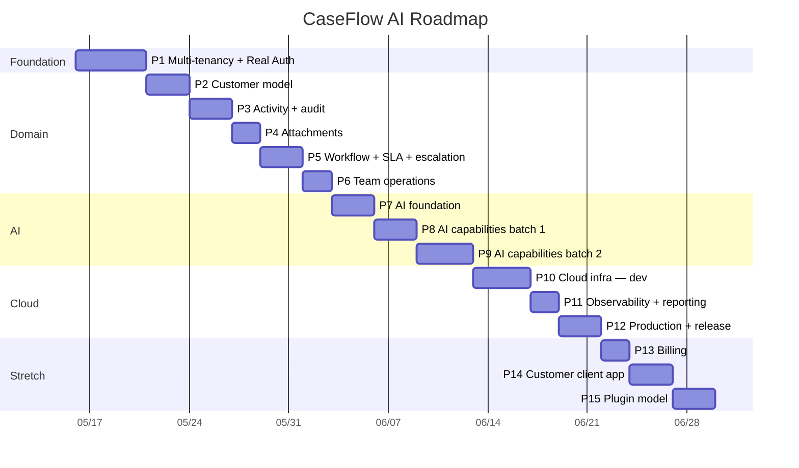

# Roadmap

Source of truth for the build sequence and current status. Updated at the end
of each phase. **Phases are units of work, not calendar days** — actual
elapsed time depends on focus and velocity.

> **Two roadmap files, two jobs.** This file is the phased *execution plan*:
> what we're building, in what order, against what acceptance criteria. The
> sibling [`docs/roadmap.md`](docs/roadmap.md) is the *feature backlog* —
> captured-but-not-scoped ideas (customer-facing client, intake API, seed
> setup, real auth pre-tenancy notes, release-please, husky pre-commit,
> notifications). Items graduate from the backlog into a phase here once
> their open questions are resolved.

---

## Status legend

| ✅ Complete | 🚧 In progress | ⏭️ Next up | ⏸️ Blocked | ⬜ Not started | 🎯 Stretch goal |
|---|---|---|---|---|---|

---

## Current state

**Today:** 2026-05-20 — **P1.9 shipping. Phase 1 closing at 9/9.** Demo seed harness produces 3 tenants, 30 users (10 per tenant across ADMIN/ENGINEER/CUSTOMER/PENDING_APPROVAL), and 105 cases (35 per tenant across statuses/priorities/ages/assignees), all keyed off deterministic UUIDs so the seed IS its own idempotency mechanism — re-running wipes seed-owned rows by exact ID and re-inserts. Local + RDS targets via `scripts/dev.sh demo:seed [--target=local|rds]`; the RDS path reuses the proven temp-public-access pattern from `db:promote-rds`. Decision log carries 26 pre-flights + 11 mid-flights.
**Active scope:** 8 / 82 sub-phases shipped (P1.8 verified locally; deploy pending). P1 (Multi-tenancy + Real Auth) is 🚧 — one sub-phase remains (P1.9 Demo seed harness). P10 (Cloud infrastructure — dev) is 🚧 — dev environment is live but a few sub-phases (ai_worker, events, formal e2e, cost guardrails) remain. Recommended order: **P1.8 deploy → P1.9 → P2**, with P10 housekeeping woven in just before P7.
**Last shipped:** **P1.9 — Demo seed harness (deterministic, idempotent, multi-tenant).** Hand-curated dataset produces realistic content for screenshots + drivable demo at caseflow.musto.io. Backend `seed/` module under `backend/src/seed/` exposes `SeedService.seedDemo()` via a CLI entrypoint (`yarn db:seed:demo`), DI-resolved through a standalone Nest application context. Deterministic UUIDs derived from `(SEED_VERSION, ...parts)` via a manual UUID v5 implementation (zero external deps) ARE the idempotency mechanism — same hashing that names a row IS what lets the seeder identify-and-wipe its own data. 23 unit tests pinned the seed contract including 3 pinned-UUID regression assertions that catch any modification to the v5 implementation at CI time. Three `scripts/dev.sh` subcommands wrap the workflow: `demo:seed [--target=local|rds]`, `demo:reset`, `demo:credentials`. RDS path reuses the proven temp-public-access pattern from `db:promote-rds` (trap-cleanup on EXIT/INT/TERM guarantees revert). Defense-in-depth production guards: `--target=rds` requires confirmation, `SeedService` refuses with `NODE_ENV=production`, only the dev account has the RDS instance the script targets. **Phase 1 closes at 9/9.** Decision log: 26 pre-flights, 11 mid-flights, every architectural choice + reversal captured. Deployed environment is now demo-ready — register-and-approve flow ready to onboard LinkedIn audience.
**Cost reminder:** Dev environment is live on AWS — ECS Fargate (1 task, 0.25 vCPU / 512 MB), RDS db.t4g.micro Postgres, ALB, CloudFront, S3 SPA bucket. ~$30-50/month at idle. Tear down with `terragrunt destroy` in each `infra/live/dev/*` stack if not actively demoing.

---

## Progress

### Overall

```
Core (P1-P12):      [██░░░░░░░░░░░░░░░░░░]  12%  ( 9 / 76 sub-phases)
Stretch (P13-P15):  [░░░░░░░░░░░░░░░░░░░░]   0%  ( 0 /  8 sub-phases)
Combined:           [██░░░░░░░░░░░░░░░░░░]  11%  ( 9 / 84 sub-phases)
```

> **Core** is the MVP — what reviewers expect to see to call the project
> defensible: a multi-tenant case-management SaaS with the AI capabilities
> the product vision calls for, deployed end-to-end to a dev environment
> and a prod environment, with audit + observability. **Stretch** is what
> ships only if there's time and a specific audience demand. The
> core/stretch split keeps progress honest: "what's required to defend
> the project" stays separated from "what's nice to have."

### By phase

| # | Phase | Bar | % | Sub-phases | Status |
|---|---|---|---|---|---|
| 1 | Multi-tenancy + Real Auth foundation       | `██████████` | 100% | 9/9 | ✅ |
| 2 | Admin section + Customer model             | `░░░░░░░░░░` | 0% | 0/7 | ⬜ |
| 3 | Activity, collaboration, audit             | `░░░░░░░░░░` | 0% | 0/6 | ⬜ |
| 4 | Attachments & documents                    | `░░░░░░░░░░` | 0% | 0/5 | ⬜ |
| 5 | Workflow engine: status, SLA, escalation   | `░░░░░░░░░░` | 0% | 0/6 | ⬜ |
| 6 | Team operations                            | `░░░░░░░░░░` | 0% | 0/5 | ⬜ |
| 7 | AI foundation                              | `░░░░░░░░░░` | 0% | 0/6 | ⬜ |
| 8 | AI capabilities — batch 1                  | `░░░░░░░░░░` | 0% | 0/5 | ⬜ |
| 9 | AI capabilities — batch 2                  | `░░░░░░░░░░` | 0% | 0/6 | ⬜ |
| 10 | Cloud infrastructure — dev                | `░░░░░░░░░░` | 0% | 0/9 | ⬜ |
| 11 | Observability + operational reporting     | `░░░░░░░░░░` | 0% | 0/6 | ⬜ |
| 12 | Production environment + release readiness| `░░░░░░░░░░` | 0% | 0/6 | ⬜ |
| 13 | Subscription & billing readiness (stretch)| `░░░░░░░░░░` | 0% | 0/3 | 🎯 |
| 14 | Customer-facing client app (stretch)      | `░░░░░░░░░░` | 0% | 0/3 | 🎯 |
| 15 | Plugin/module model + templates (stretch) | `░░░░░░░░░░` | 0% | 0/2 | 🎯 |

### Gantt — phases on a timeline

GitHub renders this Mermaid block inline. For LinkedIn/decks, export with
`mmdc -i ROADMAP.md -o roadmap.png` or screenshot the rendered version.



### Phase × Requirements matrix

Maps each phase to the [`CLAUDE.md`](CLAUDE.md) operating principles and "Do
Not" rules it specifically demonstrates. This is the requirements-alignment
view: progress isn't just "code shipped" — it's "contract clauses honored."

| Phase | Status | CLAUDE.md operating principles satisfied | CLAUDE.md "Do Not" rules satisfied | Notes |
|---|---|---|---|---|
| P1  | 🚧 | #4 (DTO/validation at auth boundary), #5 (no bypassing authorization or role checks) | #1 (no silently weakening validation), #3 (no hard-coded secrets — JWT/OAuth secrets from env), #4 (no global mutable state in tenant context) | Foundational: every later phase inherits tenant scoping |
| P2  | ⬜ | #4 (DTO validation on customer endpoints) | #5 (no skipping error handling on orphan-customer business rule) | Cases now FK to customer org |
| P3  | ⬜ | #4 (DTO for notes; visibility validated at boundary), #6 (tests for note RBAC) | #1 | Internal-vs-customer-visible enforced server-side |
| P4  | ⬜ | #4 (file-type/size validation), #6 | #1, #3 (S3 creds via env or IAM role) | Local dev uses MinIO/filesystem; real S3 lands in P10 |
| P5  | ⬜ | #4 (illegal-transition rejection), #6 (tests for state-machine + SLA clock) | #5 (business-rule error handling for illegal transitions) | State machine + SLA clock are pure domain logic |
| P6  | ⬜ | #4 (assignment-strategy inputs), #6 | #4 (routing strategy via DI, not global) | Workload metrics drive routing |
| P7  | ⬜ | #4 (Zod-validated AI tool calls), #6, #8 (Bedrock/OpenAI deps justified in decision log) | #3 (provider keys from Secrets Manager / env), #4 (provider via DI) | Platform, not feature; no user-visible AI yet |
| P8  | ⬜ | #4, #5 (AI output gated by human approval), #6 | #1 (validation around AI-generated content), #5 | Summarization + suggested resolutions |
| P9  | ⬜ | #4, #5, #6 | #1, #5 | Five more AI capabilities through the same gate |
| P10 | ⬜ | #7 (validation commands include `terraform fmt`/`validate`, `terragrunt hclfmt`), #8 (every AWS resource type justified) | #3 (zero secrets in TF), #6 (no rogue third app surface), #7 (architecture changes happen via phase spec) | First real cloud deploy; account-guard precondition prevents wrong-account applies |
| P11 | ⬜ | #6 (chaos-drill tests for alarm paths), #7 | — | Dashboards + alarms + operational reporting |
| P12 | ⬜ | #7, #11 (Conventional Commits drive release-please) | #3 (prod secrets in Secrets Manager, never in TF) | Prod environment + release automation |
| P13 🎯 | ⬜ | #4 (Stripe webhooks validated; idempotency keyed on event id) | #3, #5 | Optional stretch — pulls in only if SaaS billing is needed |
| P14 🎯 | ⬜ | #1, #6 | #6 (separate workspace introduced **with** confirmation) | Customer-facing client; deliberate "Do Not #6" exception |
| P15 🎯 | ⬜ | #1, #7 | #7 (plugin model is the architecture change, not a refactor) | Plugin/module + industry templates |

**Legend.** Operating principles and "Do Not" rules are numbered per the
root [`CLAUDE.md`](CLAUDE.md). The matrix is additive — once a clause is
satisfied by an earlier phase, later phases inherit and must not violate it.

## Notation

- **P\<N\>** — phase number (e.g., P2)
- **P\<N\>.\<M\>** — sub-phase within a phase (e.g., P1.2 = second deliverable of Phase 1)
- **Day N (YYYY-MM-DD)** — calendar day reference in the daily log
- Each phase below numbers its sub-phases so the daily log can reference them
  precisely (`Day 3 (2026-05-18) — completed P2.1, started P2.2`).

---

## Phases at a glance

| # | Phase | Status | Primary deliverable | Decision log |
|---|---|---|---|---|
| 1  | Multi-tenancy + Real Auth foundation | 🚧 (4/6) | ✅ Tenant entity · ✅ real auth (bcrypt + JWT + refresh tokens + admin approval + default tenant) · ⬜ Google OAuth + JIT · ✅ MockUserGuard → JwtAuthGuard + ActiveUserGuard · ✅ tenant-scoped queries · ⬜ frontend login | [`docs/decisions/phase-01-multi-tenancy-auth.md`](docs/decisions/phase-01-multi-tenancy-auth.md) |
| 2  | Customer model | ⬜ | CustomerOrganization + CustomerContact entities · cases FK to customer org · customer CRUD endpoints · frontend customer list/detail | _pending_ |
| 3  | Activity, collaboration, audit | ⬜ | Notes (internal vs customer-visible) · extended timeline · compliance-grade AuditLog table · frontend timeline + note composer | _pending_ |
| 4  | Attachments & documents | ⬜ | Attachment entity · presigned-URL flow · local-dev MinIO/filesystem (real S3 deferred to P10) · upload UI | _pending_ |
| 5  | Workflow engine: status, SLA, escalation | ⬜ | Status state machine · SLA clock + breach detection · data-driven escalation rules · frontend SLA badge | _pending_ |
| 6  | Team operations | ⬜ | Queue entity · routing strategies (round-robin / skill / workload) · workload dashboard | _pending_ |
| 7  | AI foundation | ⬜ | AiProvider interface · Bedrock + OpenAI adapters · versioned Prompt entity · AiInvocation audit log · SQS queue + worker pattern (local) | _pending_ |
| 8  | AI capabilities — batch 1 | ⬜ | Case summarization · suggested resolutions · human-approval gate · AI insight panel on case detail | _pending_ |
| 9  | AI capabilities — batch 2 | ⬜ | Next actions · escalation risk · sentiment · priority scoring · duplicate detection (all approval-gated) | _pending_ |
| 10 | Cloud infrastructure — dev | ⬜ | Terraform/Terragrunt: buckets · rds_postgres · backend_ecr · backend_ecs · frontend_cdn · ai_worker · events · observability · end-to-end smoke test | _pending_ |
| 11 | Observability + operational reporting | ⬜ | CloudWatch dashboard · error/SLA/AI-queue alarms · operational reporting endpoints + frontend views | _pending_ |
| 12 | Production environment + release readiness | ⬜ | `live/prod/` stacks · multi-AZ RDS · WAF · release-please · CI/CD deploys · runbooks | _pending_ |
| 13 | Subscription & billing readiness (stretch) | 🎯 | Stripe wiring · plan limits · usage metering | _pending_ |
| 14 | Customer-facing client app (stretch) | 🎯 | New `client/` workspace · magic-link auth · file-a-case + view-my-cases | _pending_ |
| 15 | Plugin/module model + industry templates (stretch) | 🎯 | Plugin interface · two reference templates (e.g., gov-contractor support, SaaS-team escalations) | _pending_ |

---

## Phase 1 — Multi-tenancy + Real Auth foundation ✅

**Goal.** Make CaseFlow AI tenant-aware and replace the demo auth with
real auth. Every existing case query gets scoped by tenant; no path in the
codebase can read another tenant's data even with a valid auth token from
a different tenant. Frontend gets a real login.

**Sub-phases & deliverables:**
- ✅ **P1.1** `Tenant` entity + `tenantId` FK on `Case` + `CaseHistory`. Shared `databaseConfig` helper. Mid-flight 1 flipped to `synchronize: true` for dev velocity; reference migration preserved at `docs/reference/migrations/`. Mid-flight 2 pinned typeorm via root `resolutions` to fix dual-install TS2322.
- ✅ **P1.2** `User` entity + real auth — bcrypt + JWT access token (15m) + opaque refresh token (7d, rotated on use). `AuthService.{register, login, refresh, logout}`. `UsersService` with hash-on-create. `PATCH /users/:id/status` admin endpoint. Default tenant ("ABC Company") seeded via `TenantsService.onModuleInit` (Pre-flight 9). PENDING_APPROVAL users CAN log in but tokens carry `status` claim (Pre-flight 8 revised). Mid-flight 4 flipped `databaseConfig` to function form so env reads happen after ConfigModule loads `.env`. Mid-flight 6 documented Bearer-in-body now / httpOnly-cookie-for-refresh switch scheduled for P1.6.
- ✅ **P1.3** Google OAuth with **JIT provisioning** — `POST /auth/google` accepts a Google ID token, verifies signature, creates the user record on first sign-in with `role=CUSTOMER` default. Backend `GoogleVerifier` wraps `google-auth-library.verifyIdToken` (Pre-flight 22: JWKS, signature, audience, issuer, expiry all handled in-library). `googleSignIn` flow: verify → findByGoogleSub → findByEmail (link) → createUserFromGoogle (JIT). Frontend uses `@react-oauth/google` `GoogleLogin` button, conditionally rendered when `VITE_GOOGLE_CLIENT_ID` is set.
- ✅ **P1.4** `JwtAuthGuard` + `ActiveUserGuard` registered globally as `APP_GUARD` (Pre-flight 10). `@Public()` decorator opt-out on `/auth/*`. `@CurrentUser()` parameter decorator replaces `@Request() req` in controllers. `MockUserGuard` retained behind `USE_MOCK_USER_GUARD` env flag (Pre-flight 11). Cases + Users controllers refactored to drop per-controller guards.
- ✅ **P1.5** `CasesService` scopes every query by `tenantId`. Cross-tenant access returns 404 (Pre-flight 12). Latent NOT-NULL bug from P1.1 fixed: `create` + `recordHistory` now stamp tenantId. Mid-flight 7 fixed a TypeORM `@JoinColumn` naming bug across four entities (snake_case vs camelCase phantom dual columns).
- ✅ **P1.6** Frontend: login page (basic + Google), auth state in Redux Toolkit slice, axios client interceptor adds bearer token + auto-refresh on 401. Three route wrappers: `PublicOnly` (auth'd users bounce out), `RequireAuth` (any auth state), `RequireActiveAuth` (ACTIVE only). `PENDING_APPROVAL` users land on `/awaiting-approval`. Mid-flight 6 hybrid-cookie transport: httpOnly refresh cookie (`Path=/auth`, `SameSite=Strict`, `Secure` in prod), access token in Redux only. Mid-flight 8 session bootstrap: `App.tsx` dispatches `refreshThunk` on mount and gates `<Routes>` render until resolution, keeping users signed in across page reloads.
- ✅ **P1.7** **Internal-only tour infrastructure** — react-joyride-based tour engine, `data-tour-id` DOM convention, declarative tour definitions under `frontend/src/tours/`, `<TourEngine />` mounted inside `<Layout />` (gated to `ENGINEER` + `ADMIN` roles, never renders for `CUSTOMER`). `UserTourState` entity persists completion + version per user; `GET /tour-state` + `POST /tour-state` endpoints. First onboarding tour walks the post-login surface in 4 steps. Mid-flight 9 captured the proxy-allowlist-drift footgun: every new backend resource needs a Vite proxy entry AND a CloudFront ordered behavior — three touchpoints (NestJS controller + Vite proxy + CloudFront behavior). See Pre-flight 23 + Mid-flight 9.
- ✅ **P1.8** **Engineer Dashboard MVP** — widget-composed dashboard at `/` for `ENGINEER` + `ADMIN`. Widget contract `{ id, title, audience, Component }` in `frontend/src/features/dashboard/`. MVP ships three widgets: `QuickActions` (Create-case dialog placeholder + stubbed search), `MyOpenCases` (priority + age sort), `RecentActivity` (5 most-recently-updated cases). Shared `casesSlice` ensures the dashboard fires `GET /cases` exactly once regardless of widget count. `DashboardRouter` switches `/` between Dashboard and the existing `<Home />` placeholder based on role. Onboarding tour re-anchored to dashboard widgets (v2). Mid-flight 10 captured the RTK thunk-dedup-via-condition pattern and the global Express etag disable. See Pre-flight 24 + Mid-flight 10.
- ✅ **P1.9** **Demo seed harness** — backend `seed/` module (`backend/src/seed/`) with TenantsFactory + UsersFactory + CasesFactory orchestrated by `SeedService`. CLI entrypoint via `yarn db:seed:demo` (standalone Nest application context — no HTTP server). Deterministic UUID v5 (manual implementation, zero deps) is the idempotency mechanism: same hashing names a row AND identifies it for wipe-and-reinsert. Hand-curated dataset — 35 case archetypes, 30 realistic full names (no role prefixes) — keeps screenshots stable across re-seeds. `scripts/dev.sh demo:seed/demo:reset/demo:credentials` wrap the workflow; RDS target reuses the temp-public-access trap-cleanup pattern from `db:promote-rds`. Defense-in-depth production guards (CLI flag confirmation, `NODE_ENV=production` refusal, dev-account-only RDS). 23 unit tests including 3 pinned-UUID regression assertions. See Pre-flight 25 + Pre-flight 26.

**Acceptance criteria:**
- [x] Two seeded tenants exist; a user from Tenant A authenticated with a valid JWT cannot read Tenant B's cases (returns 404, not 403, to avoid leaking existence).
- [x] Basic auth + Google OAuth both produce a usable JWT.
- [x] `MockUserGuard` is dev-only behind `USE_MOCK_USER_GUARD` env flag (default off; explicit `false` in prod terragrunt).
- [x] Frontend can log in via both methods and lands on the case list scoped to the user's tenant.
- [x] Unit tests cover: login success/failure, JWT expiry rejection, cross-tenant read attempt, RBAC denial for `CUSTOMER` trying to access engineer endpoints.
- [x] **P1.7** — Tour engine renders for `ENGINEER` + `ADMIN`; never renders for `CUSTOMER` (asserted in tests + verified in deployed env). First onboarding tour walks the post-login surface end-to-end. `UserTourState` records completion + version per user, syncs across devices.
- [x] **P1.8** — `/` route renders the Engineer Dashboard with `myOpenCases`, `recentActivity`, and `quickActions` widgets for `ENGINEER` + `ADMIN` (verified locally). Empty states designed for every widget. `CUSTOMER` users continue to land on the existing `<Home />` placeholder (formalized in P14). Onboarding tour re-anchored to dashboard widgets at version 2.
- [x] **P1.9** — `dev.sh demo:seed` populates a deterministic 3-tenant dataset locally; `dev.sh demo:seed --target=rds` (with confirmation prompt) populates the deployed dev environment. `dev.sh demo:reset` re-runs cleanly. Seed refuses to run with `NODE_ENV=production`. Verified locally with realistic-name display in the dashboard welcome heading.

**Resolved pre-flight decisions** (full text in [`docs/decisions/phase-01-multi-tenancy-auth.md`](docs/decisions/phase-01-multi-tenancy-auth.md)):

1. JWT secret source = `process.env.JWT_SECRET` via `ConfigService`; Secrets Manager in P10.
2. Tenant resolution = JWT claim only; subdomain deferred.
3. Existing dev DB = wipe and re-seed; `tenantId` NOT NULL from migration #1.
4. TypeORM mode = (originally) `synchronize: false`, reversed to `synchronize: true` for dev velocity in Mid-flight 1.
5. JWT lifetime = 15m access + 7d refresh (opaque, hashed, rotated).
6. Password policy = `@MinLength(8)`, no composition rules.
7. Registration scope = open self-service + email globally unique.
8. Admin-approval gate = login allowed for PENDING; data access gated by `ActiveUserGuard` (revised same day from "block login outright").
9. Default tenant = "ABC Company" auto-attached on registration.
10. Guard application = global `APP_GUARD` with `@Public()` opt-out.
11. `MockUserGuard` retained behind `USE_MOCK_USER_GUARD` env flag (default off).
12. Cross-tenant access response = 404 (not 403) — avoids existence-leak.
13. Vite proxy for same-origin cookie posture (P1.6).
14. Status-based routing — `PublicOnly` / `RequireAuth` / `RequireActiveAuth` (P1.6).
15. POC deploy target = us-east-1, default account, `personal` AWS CLI profile.
16. CloudFront default URL (no custom domain) for first deploy — superseded by Pre-flight 19.
17. Database + JWT secrets land in AWS Secrets Manager.
18. Manual `docker push` for first image; CI/CD deferred to P12.
19. Custom domain = `caseflow.musto.io` via existing `*.musto.io` ACM wildcard (supersedes Pre-flight 16).
20. Google sign-in links to existing email-password user (P1.3).
21. Google-registered users land in `PENDING_APPROVAL` (consistent with Pre-flight 8 revised).
22. Token verification via `google-auth-library` (handles JWKS, signature, audience, issuer, expiry).
23. Tour engine = react-joyride + `data-tour-id` DOM convention + source-controlled tour definitions + server-side `UserTourState` (P1.7). Internal-only — never renders for `CUSTOMER`.
24. Engineer Dashboard = widget-registry composition at `/` route, MVP ships `myOpenCases` + `recentActivity` + `quickActions` (P1.8). Each subsequent phase adds widgets.
25. Demo seed = deterministic, idempotent, multi-tenant; entry points `yarn db:seed:demo` + `dev.sh demo:seed`; refuses to run with `NODE_ENV=production` (P1.9).
26. User identity display fields (`name`, `email`) ride as additional JWT claims rather than a separate `/users/me` endpoint — Path A from the JWT-vs-fetch trade-off, defensible for a portfolio MVP. Revisit when profile data grows past name/email or regulatory context demands PII off-token (P1.8 follow-on).

**Mid-flight reversals/fixes captured in the same log:**

1. Reverted Pre-flight 4 to `synchronize: true` for dev velocity.
2. Pinned `typeorm` via root `resolutions` to fix dual-install TS2322.
3. Removed unused migration scaffolding (moved migration to `docs/reference/`).
4. Flipped `databaseConfig` to function form to fix config-load-order trap.
5. (skipped — number never assigned).
6. Documented Bearer-in-body now, httpOnly cookie for refresh in P1.6.
7. Aligned `@JoinColumn` names with `@Column` property names across four entities.
8. Session bootstrap pattern — `App.tsx` fires `refreshThunk` on mount and gates `<Routes>` render until resolution, keeping users signed in across page reloads (post-P1.3 regression fix).
9. Vite proxy + CloudFront behavior allowlist drift — every new backend resource needs a Vite proxy entry AND a CloudFront ordered behavior; missing either causes silent 200-with-HTML or 404 failures. Three-touchpoint rule going forward (P1.7).
10. RTK thunk dedup belongs in `condition`, not the body (the body sees post-pending state); Express's global etag generation disabled to eliminate mystery 304 responses (P1.8).
11. CloudFront path patterns for API routes use `/resource*`, not `/resource/*` — the slash-asterisk form leaves bare-collection endpoints unrouted, falling through to the SPA fallback. All four ordered behaviors corrected (P1.8 post-deploy).

**Dependencies:** None (foundation phase).

**Where to look:**

- [`docs/decisions/phase-01-multi-tenancy-auth.md`](docs/decisions/phase-01-multi-tenancy-auth.md)
- [`sdlc-roadmap-requirements/docs/tasks/dev-ready/p1-1-tenant-entity.md`](sdlc-roadmap-requirements/docs/tasks/dev-ready/p1-1-tenant-entity.md)
- [`sdlc-roadmap-requirements/docs/tasks/dev-ready/p1-2-user-auth.md`](sdlc-roadmap-requirements/docs/tasks/dev-ready/p1-2-user-auth.md)
- [`sdlc-roadmap-requirements/docs/tasks/dev-ready/p1-4-jwt-auth-guard.md`](sdlc-roadmap-requirements/docs/tasks/dev-ready/p1-4-jwt-auth-guard.md)
- [`sdlc-roadmap-requirements/docs/tasks/dev-ready/p1-5-tenant-scoped-cases.md`](sdlc-roadmap-requirements/docs/tasks/dev-ready/p1-5-tenant-scoped-cases.md)
- [`scripts/dev.sh`](scripts/dev.sh) — full-stack smoke test for the P1.1-P1.5 surface.

---

## Phase 2 — Admin section + Customer model ⬜

**Goal.** Two interleaved themes. **Admin section** — a new `/admin` surface (gated to ADMIN role) that becomes the home for everything operator-facing as the product matures; the first iteration handles user approval + the first email notification (admin awareness when new users register). **Customer model** — the existing P2 scope: introduce customer organizations, link cases to them, give engineers a customer-list / customer-detail surface.

The two themes are sequenced — Admin section lands first so subsequent customer-related admin features (P2.4+) have a home to land in. The widget-registry pattern from P1.8 carries forward to the admin dashboard, demonstrating that the registry is a reusable composition primitive, not a one-off.

**Sub-phases & deliverables:**

*Admin theme (P2.1 + P2.2):*
- ⬜ **P2.1** **Admin section foundation** — new `/admin` route (`AdminRouter` parallel to `DashboardRouter`, gated to `role === 'ADMIN'`). Widget-registry composition reused from P1.8 with a new `adminWidgets` array. First widget: `PendingApprovalUsers` — list of users in `PENDING_APPROVAL` status with one-click approve/reject buttons hitting `PATCH /users/:id/status`. ADMIN role chip in nav links to `/admin` when logged-in user has the role. Foundation for all subsequent admin functionality.
- ⬜ **P2.2** **Admin notification on user registration** — `NotificationsModule` in backend with a transport adapter (Resend is the recommended choice; SES deferred to P12). `NotificationsService.sendNewRegistration({user, tenant})` fires non-blocking from `AuthService.register()`. Email body links to the new `/admin` pending-approval surface so the admin can act in one click. `ADMIN_NOTIFY_EMAIL` env var + Resend API key in Secrets Manager. Customer-facing emails (welcome, approval) deferred — evaluated after this iteration based on actual demand from the LinkedIn audience trying the register-and-approve demo flow.

*Customer model theme (P2.3 → P2.7):*
- ⬜ **P2.3** `CustomerOrganization` entity (tenant-scoped, name, primary contact, status) + `CustomerContact` entity (tenant + customer-org scoped, email, name, phone).
- ⬜ **P2.4** Customer CRUD: DTOs + service + controller for both entities. **Admin section** picks up a `CustomerOrganizations` admin widget alongside `PendingApprovalUsers` — demonstrates the widget-registry pattern accumulating without touching the page shell.
- ⬜ **P2.5** Add `customerOrganizationId` FK to `Case`. Backfill migration for any P1-era seeded cases. Validation rejects case creation with no customer org. Demo seed harness (P1.9) extends to attach seeded cases to customer orgs.
- ⬜ **P2.6** Tests: customer CRUD happy path + tenant isolation (Tenant A cannot read Tenant B's customers); case creation rejected without customer org; notification fires exactly once per new registration; admin-only routes return 403 for non-admin users.
- ⬜ **P2.7** Frontend (engineer side): customer list page, customer detail page (shows that customer's case history), case-creation form requires picking a customer. Engineer Dashboard's `QuickActions` widget's "Create case" button now opens a real form instead of the P2-deferred placeholder.

**Acceptance criteria:**
- [ ] Admin section at `/admin` renders only for ADMIN role; non-ADMIN users get redirected to `/` (or 404, TBD in spec).
- [ ] `PendingApprovalUsers` widget lists exactly the PENDING_APPROVAL users in the admin's tenant; approve / reject buttons work end-to-end.
- [ ] Every new user registration triggers exactly one admin notification email (verified by test mock + end-to-end smoke).
- [ ] Notification failure does not block registration — `AuthService.register()` always returns successfully even if the email transport is down.
- [ ] A customer organization in Tenant A is invisible to Tenant B.
- [ ] Cases without a customer org cannot be created via the API.
- [ ] Frontend customer detail page lists all cases for that customer.

**Dependencies:** P1 (tenant scoping, user approval flow, widget-registry pattern, deployed env) complete.

**Open architectural calls (resolve in P2.1 / P2.2 specs):**

- **Admin routing** — `/admin` as a parallel route at the top level, OR `/admin/*` as a section with its own sub-routes from day one? Recommendation: `/admin` for now, expand to `/admin/users`, `/admin/customers`, etc. when there's more than one widget worth a dedicated page.
- **Notification transport** — Resend (free tier, fast setup, ~4hr) vs SES (production-grade, DNS dance, ~14hr, deferred to P12). Recommendation: Resend now, SES at P12 prod hardening.
- **Customer-facing emails** — deferred to a post-P2.2 evaluation point. Decide based on whether the register-and-approve flow surfaces a real need.

---

## Phase 3 — Activity, collaboration, audit ⬜

**Goal.** Make cases collaborative. Engineers and customers can leave
notes; the timeline shows what happened when; the audit log captures who
did what for compliance.

**Sub-phases & deliverables:**
- ⬜ **P3.1** `Note` entity — tenant-scoped, case-scoped, with `visibility: INTERNAL | CUSTOMER_VISIBLE` enum and `authorUserId` FK.
- ⬜ **P3.2** Notes service + controller + DTOs. Customer-role users can only create/read `CUSTOMER_VISIBLE` notes; engineer/admin can see both.
- ⬜ **P3.3** Extend `CaseHistory` to record richer events: `STATUS_CHANGED`, `NOTE_ADDED`, `ASSIGNMENT_CHANGED`, `PRIORITY_CHANGED`. Existing status-change recording stays; the rest is new.
- ⬜ **P3.4** Dedicated `AuditLog` entity for compliance-grade trail — every mutating API call gets a row with `actorUserId`, `action`, `targetEntity`, `targetId`, `payloadHash`, `timestamp`. Separate from `CaseHistory` so the latter stays UX-shaped.
- ⬜ **P3.5** Tests: note-visibility RBAC, timeline ordering, audit-log completeness on every mutating endpoint.
- ⬜ **P3.6** Frontend: timeline view on case detail (interleaves notes, status changes, assignment changes), note composer with internal/customer-visible toggle.

**Acceptance criteria:**
- [ ] A `CUSTOMER` user retrieving the timeline for their case sees only customer-visible entries.
- [ ] Every mutating endpoint produces an audit log row.
- [ ] Timeline is chronological and stable under concurrent updates.

**Dependencies:** P1, P2.

---

## Phase 4 — Attachments & documents ⬜

**Goal.** Cases can carry attached files. Local dev uses MinIO or the
filesystem; the real S3 wiring lands in P10. The storage abstraction lets
us swap backends without touching the service layer.

**Sub-phases & deliverables:**
- ⬜ **P4.1** `Attachment` entity (tenant + case scoped, filename, content type, size, `storageKey`, `uploaderUserId`).
- ⬜ **P4.2** `StorageBackend` interface + filesystem adapter (default) + MinIO adapter (optional, via `infra/docker-db` extension). S3 adapter stub for P10.
- ⬜ **P4.3** Presigned-URL pattern for upload + download. Backend issues the URL; client uploads/downloads directly. Validation: file size cap, MIME allowlist, virus-scan stub.
- ⬜ **P4.4** Tests: attachment ACLs (tenant + RBAC); upload size/MIME rejection; presigned-URL expiry.
- ⬜ **P4.5** Frontend: drag-drop upload component on case detail, attachment list with download links.

**Acceptance criteria:**
- [ ] A file uploaded against a Tenant A case is unreadable by Tenant B even with the storage key.
- [ ] Files over the size cap are rejected pre-upload (presigned URL not issued).
- [ ] Filesystem-backed local dev produces the same API as the S3-backed code path will in P10.

**Dependencies:** P1, P3.

---

## Phase 5 — Workflow engine: status, SLA, escalation ⬜

**Goal.** Lock down the case lifecycle. Illegal status transitions get
rejected at the service layer; SLA fields drive breach detection; escalation
rules fire automatically when conditions are met.

**Sub-phases & deliverables:**
- ⬜ **P5.1** Status state machine — pure module enforcing the transition graph: `New → Triaged → In Progress → Waiting on Customer → Escalated → Resolved → Closed`, plus permitted reverse transitions (e.g., Resolved → In Progress on reopen). Decision-log entry captures the full transition table.
- ⬜ **P5.2** SLA fields on `Case`: `firstResponseDueAt`, `resolutionDueAt`, computed at case creation from per-priority defaults. SLA badge calc is pure logic in the service layer.
- ⬜ **P5.3** SLA breach detection — scheduled job (in-process for now; queueable for P7) flags overdue cases and emits a `SLA_BREACHED` history event.
- ⬜ **P5.4** Escalation rules engine — data-driven (rules in a config table or seeded YAML): priority-elevation triggers, time-based triggers, manual-escalation endpoint. Escalation produces a `STATUS_CHANGED → Escalated` event.
- ⬜ **P5.5** Tests: illegal-transition rejection, SLA clock math (including timezone edge cases), escalation rule firing.
- ⬜ **P5.6** Frontend: status transition buttons grayed-out for illegal transitions, SLA badge with traffic-light coloring, "Escalated" banner.

**Acceptance criteria:**
- [ ] `PATCH /cases/:id/status` rejects illegal transitions with 422 and a structured error.
- [ ] SLA breach updates the case and writes a history entry within one poll cycle.
- [ ] At least one escalation rule fires end-to-end in tests.

**Dependencies:** P1, P2, P3.

---

## Phase 6 — Team operations ⬜

**Goal.** Engineers don't pick cases from a flat list — they work from
queues with deliberate routing strategies, and managers see workload at a
glance.

**Sub-phases & deliverables:**
- ⬜ **P6.1** `Queue` entity (tenant-scoped) + many-to-many `case_queue` join. A case can sit in multiple queues (e.g., "Billing" + "High Priority").
- ⬜ **P6.2** Assignment routing strategy interface — round-robin, skill-match (engineer profiles carry tags), workload-balance (assigns to lowest-load engineer). Strategies registered via DI so adding a new one is a single class.
- ⬜ **P6.3** Workload service — engineer-to-stats projection (open case count, breached-SLA count, average resolution time over a window).
- ⬜ **P6.4** Tests: each routing strategy with mocked engineer pools; workload metrics correctness.
- ⬜ **P6.5** Frontend: queue views (filterable case list scoped to a queue), workload dashboard (table or grid of engineers with their stats).

**Acceptance criteria:**
- [ ] Three routing strategies registered and tested.
- [ ] Workload dashboard reflects assignments within one polling interval.

**Dependencies:** P1, P5 (SLA fields drive workload).

---

## Phase 7 — AI foundation ⬜

**Goal.** Build the AI platform layer with no user-visible AI features yet.
Future phases plug into this. Provider-agnostic, versioned prompts,
auditable, queue-based — the four properties that distinguish a serious AI
surface from a "call OpenAI in a controller" prototype.

**Sub-phases & deliverables:**
- ⬜ **P7.1** `AiProvider` interface + Bedrock adapter (primary). Provider methods: `invoke(promptVersion, input) → output | error`. Bedrock used because the SaaS path will run in AWS and IAM is cleaner than rotating API keys.
- ⬜ **P7.2** OpenAI adapter (alt). Provider selection via env or per-prompt config so we can fall back or A/B at the prompt level.
- ⬜ **P7.3** `Prompt` entity + versioning — a prompt has a logical name (`case.summarize`) and many immutable versions. An invocation always references a specific version, so reproducibility is free.
- ⬜ **P7.4** `AiInvocation` audit log — every call records provider, prompt version, input hash, output, cost (tokens × pricing), latency, success/failure, the human-approval state.
- ⬜ **P7.5** SQS-backed processing — backend enqueues an AI job, an out-of-process worker dequeues + invokes the provider. Local dev runs the worker as a separate yarn script; SQS itself is mocked locally via [LocalStack](https://localstack.cloud/) or an in-memory bus, with the real SQS landing in P10.
- ⬜ **P7.6** Tests: provider fallback (primary throws → secondary invoked), prompt-version pinning, audit-log completeness, queue idempotency.

**Acceptance criteria:**
- [ ] Calling `aiService.summarize(case)` enqueues a job, the worker runs it, and the result lands back via an outbox/event with a matching audit row.
- [ ] An `AiInvocation` row exists for every provider call, success or failure.
- [ ] Swapping providers requires zero changes outside the adapter file.

**Open decisions to resolve at start:**
1. Provider fallback — automatic on error, or explicit per-prompt?
2. Cost tracking — record per invocation only, or also aggregate per tenant for billing-readiness (anticipates P13)?
3. Local-dev queue — LocalStack, in-memory, or both?

**Dependencies:** P1 (tenant), P3 (audit log table can be extended or AI uses its own).

---

## Phase 8 — AI capabilities — batch 1 ⬜

**Goal.** Ship the first two user-visible AI features with full
human-in-the-loop gating. No AI output reaches a customer-visible surface
without an engineer's approval.

**Sub-phases & deliverables:**
- ⬜ **P8.1** Case summarization — `POST /cases/:id/ai/summarize` enqueues a summarization job; result lands as a `pending_review` AI artifact. Prompt versioned under `case.summarize.v1`.
- ⬜ **P8.2** Suggested resolutions — `POST /cases/:id/ai/suggest-resolution` enqueues a job that produces a ranked list of candidate resolutions with citations to past similar cases (uses the case history as RAG context).
- ⬜ **P8.3** Human approval flow — `AiArtifact` state machine: `pending → approved | rejected | edited`. Approved/edited artifacts can flow to customer-visible surfaces; rejected ones stay internal-only and feed a "what the AI got wrong" log.
- ⬜ **P8.4** Tests: rejected artifacts never appear on customer-visible endpoints; approval flow audit-logged; edit preserves AI-original alongside the human-edited version.
- ⬜ **P8.5** Frontend: AI insight panel on case detail (Summary + Suggested Resolutions sections), approval controls, edit-in-place.

**Acceptance criteria:**
- [ ] A summarization request produces a reviewable artifact and writes one `AiInvocation` row.
- [ ] A rejected suggested-resolution is invisible to customer-role users.
- [ ] An approved + edited summary preserves both the AI version and the human-edited version.

**Dependencies:** P7.

---

## Phase 9 — AI capabilities — batch 2 ⬜

**Goal.** Ship the remaining five AI capabilities from the product vision
through the same approval gate established in P8.

**Sub-phases & deliverables:**
- ⬜ **P9.1** Recommended next actions — given case state, prompt produces a 2-3 item action list.
- ⬜ **P9.2** Escalation risk detection — classifier prompt produces `low | medium | high` plus reasoning; high-risk surfaces a banner.
- ⬜ **P9.3** Sentiment analysis — per-note sentiment + rolling case-level sentiment.
- ⬜ **P9.4** Priority scoring — prompt produces a suggested priority; manager can accept/override.
- ⬜ **P9.5** Duplicate issue detection — embedding-based similarity over open cases in the same tenant; surfaces "possible duplicates" panel.
- ⬜ **P9.6** Tests + frontend wiring for each capability.

**Acceptance criteria:**
- [ ] All five capabilities pass through the P8 approval flow.
- [ ] Duplicate detection respects tenant boundaries (no cross-tenant matches).

**Dependencies:** P7, P8.

---

## Phase 10 — Cloud infrastructure — dev ⬜

**Goal.** Stand up the dev environment end-to-end on AWS. First real cloud
deploy. Mirrors the modular monolith pattern: ECS Fargate for the NestJS
API, Lambda for the AI worker, RDS for Postgres, CloudFront in front of
S3 for the frontend.

**Sub-phases & deliverables:**
- ⬜ **P10.1** Run `infra/bootstrap` (one-time) — creates the tfstate S3 bucket + DynamoDB lock table. Capture outputs into `live/dev/terragrunt.hcl` + `live/prod/terragrunt.hcl`.
- ⬜ **P10.2** `buckets` module + `live/dev/storage` stack — attachments bucket, build artifacts bucket, uploads bucket. Wire `Attachment` storage adapter's S3 path (introduced in P4) to the dev attachments bucket.
- ⬜ **P10.3** `rds_postgres` module + `live/dev/database` stack — managed Postgres, credentials in Secrets Manager. Backend reads the secret via IAM.
- ⬜ **P10.4** `backend_ecr` module + `live/dev/ecr` stack — ECR repo for the NestJS image. CI pushes on main merge.
- ⬜ **P10.5** `backend_ecs` module + `live/dev/backend` stack — Fargate service, ALB, security groups. Pulls image from ECR (P10.4), DB creds from Secrets Manager (P10.3), bucket names from terragrunt deps (P10.2).
- ⬜ **P10.6** `frontend_cdn` module + `live/dev/frontend` stack — S3 bucket for Vite build output + CloudFront distribution with OAC + SPA-friendly 403/404 → `/index.html` rewrite. `/api/*` behavior forwards to the ALB.
- ⬜ **P10.7** `ai_worker` module + `live/dev/ai-worker` stack — SQS queue + Lambda worker function. Worker pulls Bedrock IAM permissions, prompt config from Parameter Store / Secrets Manager.
- ⬜ **P10.8** `events` module + `live/dev/events` stack — EventBridge bus + cross-cutting rules (case events fan out to AI worker + audit log + notifications-stretch).
- ⬜ **P10.9** End-to-end smoke test — log in via deployed frontend, create a case, attach a file, request an AI summary, see it pending-review in the dashboard.

**Acceptance criteria:**
- [ ] `cd infra/live/dev/<stack> && terragrunt apply` succeeds for every stack against the dev account.
- [ ] The deployed frontend can talk to the deployed backend, which can read/write the deployed DB, which fronts the deployed bucket.
- [ ] An AI job enqueued via the backend lands in SQS and is processed by the worker Lambda.
- [ ] `terraform destroy` runs cleanly on every stack (cost hygiene).

**Open decisions to resolve at start:**
1. VPC — use the AWS default VPC (cheaper, faster to deploy) or stand up a dedicated VPC module first?
2. Custom domain — point at `caseflow.dev.example.com` via ACM + Route 53, or live with the CloudFront default URL for now?
3. CI image push — GitHub Actions pushing to ECR with OIDC, or manual `docker push` for the first deploy?

**Dependencies:** P1-P9 complete enough that the code being deployed actually works. (No requirement for every phase to be feature-complete — P10 can ship with P9 still mid-batch.)

---

## Phase 11 — Observability + operational reporting ⬜

**Goal.** Production-grade visibility. CloudWatch dashboard renders the
state of the system at a glance; alarms fire on the things that matter
(SLA breaches, error rates, AI queue depth); the frontend exposes
operational reporting views for managers.

**Sub-phases & deliverables:**
- ⬜ **P11.1** Structured logging audit across backend — every controller exit logs `tenantId`, `userId`, `requestId`. Replace any remaining `console.log`s with the project's logger.
- ⬜ **P11.2** `observability` module + `live/dev/observability` stack — CloudWatch dashboard with backend latency p50/p95/p99, error rates, AI queue depth, SLA breach count, case throughput by status.
- ⬜ **P11.3** Alarms with SNS-actioned escalation: backend 5xx rate, AI worker failure rate, AI queue age, SLA-breach rate threshold, DLQ depth.
- ⬜ **P11.4** Operational reporting endpoints — `/reports/case-volume`, `/reports/sla-compliance`, `/reports/ai-usage` (tenant-scoped, role-gated).
- ⬜ **P11.5** Frontend: operational reporting views (charts powered by the endpoints above), filterable by date range + queue.
- ⬜ **P11.6** Chaos drill — force-fail the AI worker, force-burn an SLA, prove the alarms fire and the dashboard reflects it.

**Acceptance criteria:**
- [ ] Every alarm fires under a forced-failure scenario.
- [ ] The dashboard renders non-empty data after a smoke run.
- [ ] Operational reporting views match the underlying DB to the row.

**Dependencies:** P5 (SLA), P7 (AI metrics), P10 (cloud).

---

## Phase 12 — Production environment + release readiness ⬜

**Goal.** Promote the dev environment shape to production with the
expected hardening. Land the release-automation primitives so cuts ship
without a checklist sprint each time.

**Sub-phases & deliverables:**
- ⬜ **P12.1** `live/prod/<stack>/` stacks mirror dev — same modules, prod inputs (larger Fargate task sizes, multi-AZ RDS, longer log retention).
- ⬜ **P12.2** WAF on CloudFront (rate limit, OWASP top-10 managed rules). Tighter IAM (no broad `*` actions in any module).
- ⬜ **P12.3** Multi-AZ RDS + automated backups + point-in-time recovery enabled.
- ⬜ **P12.4** release-please configured for both `@caseflow-ai/backend` and `@caseflow-ai/frontend` workspaces — Conventional Commits drive the changelog + version bump PR.
- ⬜ **P12.5** GitHub Actions CI/CD — main-merge deploys to dev, tag deploys to prod (with manual approval gate on the prod job).
- ⬜ **P12.6** Runbooks — rollback procedure, incident response, on-call rotation placeholder, secrets rotation steps.

**Acceptance criteria:**
- [ ] Prod environment passes the same end-to-end smoke test as P10.9.
- [ ] release-please opens a real release PR after a Conventional-Commit push to main.
- [ ] Rollback runbook can be executed by a reader without prior context (validated by walk-through).

**Dependencies:** P10, P11.

---

## Phase 13 — Subscription & billing readiness 🎯 (stretch)

**Goal.** If CaseFlow AI becomes a real SaaS, billing has to work. Stripe
is the assumed integration. Plan limits + usage metering get enforced at
the service layer.

**Sub-phases & deliverables:**
- ⬜ **P13.1** Stripe wiring — webhook endpoint with signature verification, `Subscription` entity per tenant, customer-portal handoff.
- ⬜ **P13.2** Plan limits — config-driven caps (cases/month, AI invocations/month, attachments/GB), enforced in service layer with structured 402 responses.
- ⬜ **P13.3** Usage metering — aggregate `AiInvocation` cost into a per-tenant monthly bucket; surface in admin dashboard.

**Acceptance criteria:**
- [ ] A tenant exceeding its plan gets blocked with a clear 402 error.
- [ ] Usage report matches Stripe's invoice total.

**Dependencies:** P10 (cloud), P11 (observability for the metering pipeline).

---

## Phase 14 — Customer-facing client app 🎯 (stretch)

**Goal.** A separate, lighter customer-facing workspace. Carries forward
the [feature backlog](docs/roadmap.md)'s "Customer-Facing Client Application"
entry. **Deliberate exception to `CLAUDE.md` Do Not #6** — a third app
surface requires confirmation, and this phase is that confirmation.

**Sub-phases & deliverables:**
- ⬜ **P14.1** New workspace `client/` — React + Vite scaffold, shares the existing axios client config but its own routing tree.
- ⬜ **P14.2** Auth — magic-link email + claim-by-email (lighter than the engineer-side Google OAuth flow).
- ⬜ **P14.3** Minimum surface — file a case (creates a customer-visible note + new case), view-my-cases, attach files.

**Acceptance criteria:**
- [ ] A customer can self-serve from signup to case-filed without engineer intervention.
- [ ] Customer-visible surfaces never expose internal notes or rejected AI artifacts.

**Dependencies:** P3 (note visibility), P4 (attachments).

---

## Phase 15 — Plugin/module model + industry templates 🎯 (stretch)

**Goal.** Carries forward "Phase 5 — Platform Expansion" from the legacy
`sdlc-roadmap-requirements/docs/product/roadmap.md`. Turns CaseFlow AI
from one product into a platform on which industry-specific verticals can
be built quickly. **Deliberate exception to `CLAUDE.md` Do Not #7** —
this is an architecture change, executed via this phase spec rather than
a free-form refactor.

**Sub-phases & deliverables:**
- ⬜ **P15.1** Plugin interface — NestJS dynamic module pattern, plugins register entities, services, prompts, and frontend route bundles. Defined under `backend/src/plugins/` and `frontend/src/plugins/`.
- ⬜ **P15.2** Two reference templates — `gov-contractor-support` (FOIA-style audit emphasis) and `saas-team-escalations` (PagerDuty-style on-call) — proving the plugin model isn't single-implementation theater.

**Acceptance criteria:**
- [ ] Disabling a plugin removes its routes, entities, and frontend bundle without code changes outside config.
- [ ] Both reference templates pass their own integration tests.

**Dependencies:** P12 (production-shape platform to extend).

---

## How this file is updated

1. At the **start** of each phase: confirm the goal, sub-phase list, acceptance
   criteria, and dependencies. If anything has drifted from reality, fix it
   here before writing any code.
2. At the **end** of each phase: flip the status emoji, fill in the decision-log
   link, update the "Current state" header (today's date, last-shipped paragraph,
   any new cost reminders), and refresh the progress bars.
3. **Scope changes** (a phase splits, merges, or moves between core and stretch)
   are recorded inline near the affected phase with a short rationale, the way
   Grid-Sensor-Pipeline's `ROADMAP.md` documents its Phase 12 scope-down.
4. The **feature backlog** at [`docs/roadmap.md`](docs/roadmap.md) is the
   intake side. Items move from there into a phase here once we have a goal,
   acceptance criteria, and a place in the sequence.
5. **Decision logs** land in `docs/decisions/phase-NN-<slug>.md` (mirrors
   Grid-Sensor-Pipeline). Each phase's "Where to look" entry points at its
   decision log once the phase opens.
